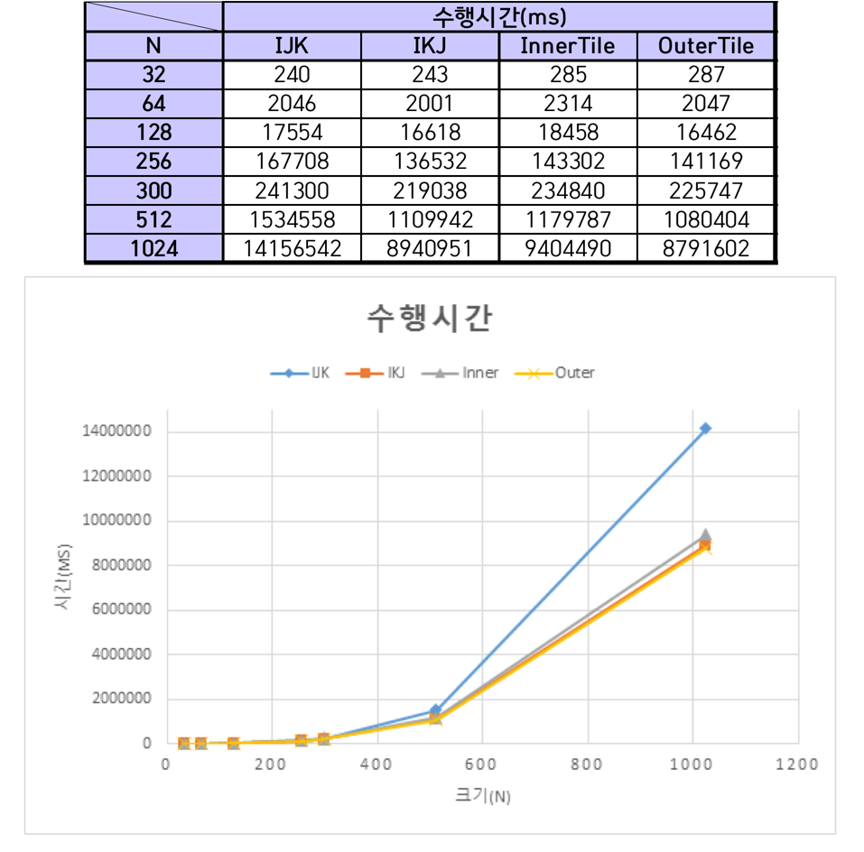
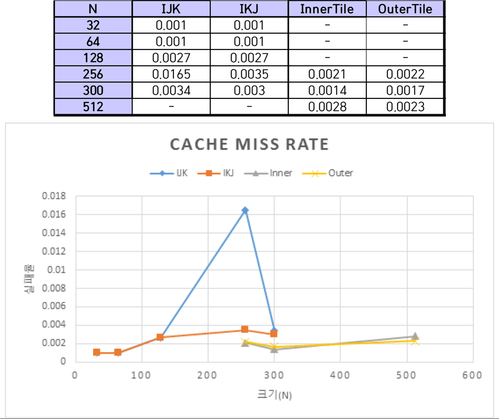
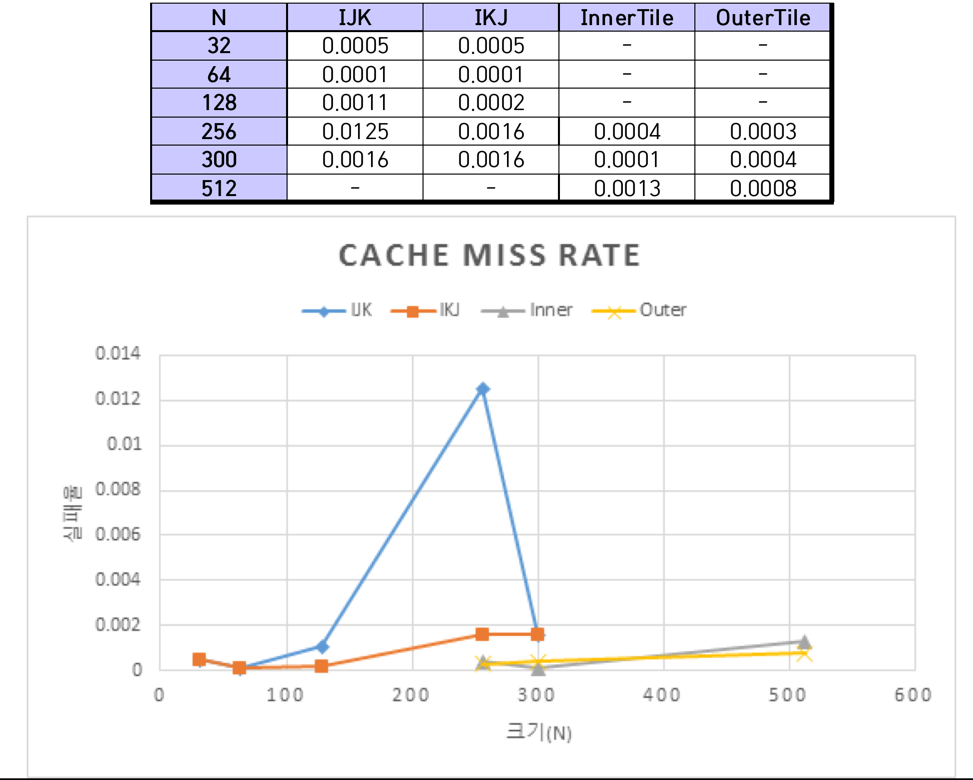

# 개요

Matrix Multiplication을 IJK, IKJ, InnerTile, OuterTile의 4가지 방법으로 구현한 후 각 프로그램의 수행 시간을 측정한다. 프로그램들의 성능 차이를 SimpleScalar를 이용한 cache simulation을 통해 도출된 cache miss rate를 바탕으로 설명한다.

# SimpleScalar 설치 및 시뮬레이션 환경 구축

## SimpleScalar 설치

SimpleScalar 홈페이지에서 simplesim(3.0v), simpletools(2.0v), simpleutils를 내려받아 설치하였다. 해당 설치파일에서 크로스컴파일을 위해 제공되는 gcc 2.6.3버전은 Ubuntu 16.04에서 원활히 설치되지 않는다. 따라서, gcc 2.7.2.3을 이용해 크로스컴파일 환경을 구축하였다.

## SimpleScalar 설치 과정 중 문제 해결

SimpleScalar의 메인 프로그램인 simplesim을 설치하는 과정에서는 큰 문제가 없었다. simplesim을 설치하는 과정에서는 환경변수를 설정하고 압축을 풀고 make를 해주면 설치가 완료되었다. 그러나, GCC cross-compiler를 설치하는 과정에서 많은 문제가 일어났다. GCC 7.1버전이 나온 지금 GCC 2.6.3을 설치하려고 하니 쉽지 않았다. 프로젝트를 진행하는 환경에는 GCC 5.4.0버전이 설치되어 있었는데, 해당 버전으로 GCC 2.6.3을 컴파일하려니 많은 문법 오류가 발생했다. 문법 오류가 발생하면 오류가 발생한 소스코드를 찾아 문제를 해결하고 다시 컴파일하는 과정을 반복해야만 했다. cross-compiler를 설치하는 과정 중 대부분은 다음의 사이트에서 도움을 받았다.

> [Installing simplescalar on Ubuntu 16.04](http://io.wxa.me/simulation/2017/03/13/simplescalar_installation)

## sim-cache 환경설정 파일

cache크기: 64Kb, cache line size: 32bytes, 블록 교체 방식: LRU

- Direct_mapped_cache.cfg

  ```
  -cache:il1 dl1
  -cache:dl1 dl1:2048:32:1:l
  # Instruction L1 cache,
  # # of sets = 2048, block size = 32, No of sets = 1 so Cache size = 2048*32*1 = 64 Kbytes,
  # Replacement = LRU
  -cache:il2 none
  -cache:dl2 none
  -tlb:itlb none
  -tlb:dtlb none
  ```

- 4way_set_associative.cfg

  ```
  -cache:il1 dl1
  -cache:dl1 dl1:512:32:4:l
  # Instruction L1 cache,
  # # of sets = 512, block size = 32, No of sets = 4 so Cache size = 512*32*4 = 64 Kbytes,
  # Replacement = LRU
  -cache:il2 none
  -cache:dl2 none
  -tlb:itlb none
  -tlb:dtlb none
  ```

- 환경설정 파일을 이용한 sim-cache 실행

  ```
  sim-cache -config direct_mapped_cache.cfg ./IJK 256
  sim-cache -config 4way_set_associative.cfg ./IJK 64
  ```

# Matrix Multiplication 구현

Matrix Multiplication을 IJK, IKJ, InnerTile, OuterTile의 4가지 방법으로 구현한 후 각 프로그램의 수행 시간을 측정한다.

## 공통 소스코드

```c
#include<stdio.h>
#include<stdlib.h>
#include<time.h>

// 행렬 초기화
void init (int *a, int *b, int *c, int size) {
    int i;

    for(i = 0; i<size*size; i++) {
        a[i] = 1;
        b[i] = 1;
        c[i] = 0;
    }
}

// 행렬 곱셈
long multiply (int *a, int *b, int *c, int size) {
(생략)
}

int main (int argc, char** argv) {
    int n;              // 행렬 사이즈
    long cpu_time;    // 실행 시간
    int *a, *b, *c;     // 행렬

    // 입력 예외처리
    if(argc != 2) {
        printf("Usage: %s [size]\n", argv[0]);
        return EXIT_FAILURE;
    }
    n = atoi(argv[1]);

    // 행렬 생성
    a = (int *)malloc(sizeof(int)*n*n);
    b = (int *)malloc(sizeof(int)*n*n);
    c = (int *)malloc(sizeof(int)*n*n);

    // 행렬 초기화
    // 값에 따른 연산 차이를 최소화하기 위해 상수로 초기화
    init(a, b, c, n);

    // 행렬 곱셈
    cpu_time = multiply(a, b, c, n);
    printf("cpu_time: %ldms\n", cpu_time);

    // 자원반납
    free(a);
    free(b);
    free(c);

    return 0;
}
```

## IJK.c

```c
// 행렬 곱셈
// IJK
long multiply (int *a, int *b, int *c, int size) {
    clock_t start, end;
    int i, j, k;

    start = clock();
    for(i = 0; i < size; i++) {
        for(j = 0; j < size; j++) {
            for(k = 0; k < size; k++) {
                c[i*size+j] += a[i*size+k] * b[k*size+j];
            }
        }
    }
    end = clock();

    return (end - start);
}
```

## IKJ.c

```c
// 행렬 곱셈
// IKJ
long multiply (int *a, int *b, int *c, int size) {
    clock_t start, end;
    int i, j, k;

    start = clock();
    for(i = 0; i < size; i++) {
        for(k = 0; k < size; k++) {
            for(j = 0; j < size; j++) {
                c[i*size+j] += a[i*size+k] * b[k*size+j];
            }
        }
    }
    end = clock();

    return (end - start);
}
```

## InnetTile.c

```c
// 행렬 곱셈
// InnerTile
long multiply (int *a, int *b, int *c, int size, int s1, int s2) {
    clock_t start, end;
    int i, j, k, t1, t2;

    start = clock();
    for(t1 = 0; t1 < size; t1+=s1) {
        for(t2 = 0; t2 < size; t2+=s2) {
            for(i = 0; i < size; i++) {
                for(k = t1; k < MIN(size, t1+s1); k++) {
                    for(j = t2; j < MIN(size, t2+s2); j++) {
                        c[i*size+j] += a[i*size+k] * b[k*size+j];
                    }
                }
            }
        }
    }
    end = clock();

    return (end - start);
}
```

## OuterTile.c

```c
// 행렬 곱셈
// OuterTile
long multiply (int *a, int *b, int *c, int size, int s1, int s2) {
    clock_t start, end;
    int i, j, k, t1, t2;

    start = clock();
    for(t1 = 0; t1 < size; t1+=s1) {
        for(t2 = 0; t2 < size; t2+=s2) {
            for(i = t1; i < MIN(size, t1+s1); i++) {
                for(k = t2; k < MIN(size, t2+s2); k++) {
                    for(j = 0; j < size; j++) {
                        c[i*size+j] += a[i*size+k] * b[k*size+j];
                    }
                }
            }
        }
    }
    end = clock();

    return (end - start);
}
```

# 수행시간 측정

행렬의 크기가 1024 이상이 되면 프로그램 실행시간이 측정하기 힘들 정도로 긴 시간동안 프로그램이 수행되었다. 따라서 1024 이하 크기에 대한 연산 수행시간을 측정하였다.



# Cache miss rate 측정

sim-cache를 이용해 Cache miss rate를 측정하였다. 시뮬레이션 환경은 Direct mapped cache와 4-way set associative의 2가지 환경이다. 각각의 환경은 미리 정의한 환경설정 파일(.cfg)를 통해 불러온다. sim-cache를 통해 프로그램을 시뮬레이션하면 기존의 환경보다 수행 속도가 더뎠다. 따라서 IJK와 IKJ경우에는 300이하의 크기에 대해서 시뮬레이션을 실시하였고, InnerTile과 OuterTile의 경우에는 256, 300, 512 크기에 대해 시뮬레이션을 진행하였다.

- InnerTile과 OuterTile의 시뮬레이션 조건은 다음과 같다.

  ```
  N=256, 300, 512
  N=256: inner tile의 t1=8, t2=8
         outer tile t1=8, t2=1 (direct), t1=6, t2=1(4-way)
  N=300: inner tile의 t1=40, t2=40
         outer tile t1=6, t2=1 (direct), t1=4, t2=1(4-way)
  N=512: inner tile의 t1=4, t2=4
         outer tile t1=4, t2=1 (direct), t1=2, t2=1(4-way)
  ```

## Direct Mapped Cache



## 4-way Set Associate



# 분석 및 고찰

## IJK와 IKJ의 비교

행렬의 크기가 커질수록 IJK의 수행시간보다 IKJ의 수행시간이 훨씬 짧아졌다. cache miss rate 또한 IJK보다 IKJ가 낮았다. 행렬의 크기가 512 이상으로 커질 경우 simplescalar 시뮬레이션하지 못할 만큼 걸리는 시간이 매우 길어 측정하지 못하였지만, cache miss rate의 변화 추세를 보아 IKJ가 IJK보다 낮을 것으로 예상한다.

프로그램에서 행렬을 표현하기 위해 2차원 배열을 사용한다. 그런데, 실제 프로그램 내부에서 2차원 배열은 메모리에 순차적으로 나열된다. 따라서, 같은 행에 있는 행렬의 원소들이 메모리상 근처에 위치한다. IKJ가 수행되는 과정을 보면 IJK와 달리 행을 변경하며 연산하지 않기 때문에 cache miss rate가 낮고 수행시간이 빠르다. cache miss가 자주 일어나면 교체작업에 대한 시간 지연이 발생하므로 대체로 cache miss rate가 낮으면 수행시간 또한 빠를 것이라 예상한다.

## InnerTile과 OuterTile의 비교

InnerTile과 OuterTile 모두 블록화 알고리즘이다. 블록화 알고리즘은 블록 단위로 배열을 처리함으로써 캐시에 적재된 데이터가 교체되기 전에 최대한 사용하도록 함으로써 Cache miss rate를 줄이는 것이 목표다. 실험 결과 InnerTile과 OuterTile모두 IJK/IKJ보다 Cache miss rate가 낮다는 것을 확인할 수 있었다.

InnerTile과 OuterTile의 수행시간을 비교해보면 OuterTile이 InnerTile보다 연산에 걸리는 시간이 짧았다. OuterTile은 제일 내부 반복문에서 행단위 연산을 수행하기 때문에 InnerTile에 비해 수행시간이 짧은 것으로 생각한다.

## Direct Mapped Cache와 4-way Set Associative Cache 비교

같은 알고리즘에 대하여 Direct mapped cache와 4-way set associative cache의 cache miss rate를 비교했을 때 4-way set associative cache가 더 낮았다. 이를 통해 직접 사상방식을 사용하는 것보다 집합 연관 방식을 사용하는 것이 cache 실패율을 줄일 수 있다는 것을 확인할 수 있었다.
