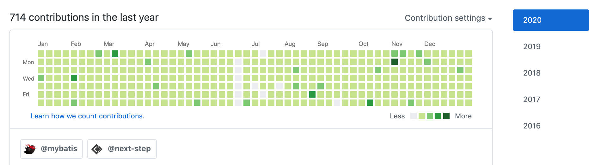

# 조금 늦어진 회고

2020년 1월 11일인 지금에서야 블로그에 회고 글을 작성하게 되었습니다. 작년 말에 많은 분들이 작성한 회고 글을 보면서 자극과 도움을 동시에 얻을 수 있었습니다. 사실 작년 한 해를 돌아보는 시간과 올해의 계획을 작성하는 시간을 개인적으로 가지긴 했습니다. 블로그에 회고 글을 작성할까도 생각해보았지만 부끄러움이 밀려와 블로그 작성은 포기했습니다. 그런데 결국 저는 회고 글을 작성하고 있네요.

벌써 2020년을 맞이한 지 10일이 지났습니다. 한 해의 비율로 따지면 대략 1/36 정도를 지나온 셈입니다. 이렇게 계산해보니 1년이 참 짧은 기간이라는 게 몸소 와닿네요. 2020년이 10일밖에 지나지 않았지만, 지금 지내온 기간을 35번만 반복하면 한 해가 지난다는 뜻이니까요. 제가 회고 글을 작성하게 된 계기가 여기에 있습니다. 이렇게 소중한 10일이지만, 10일 동안 새해에 목표한 계획을 제대로 실천하지 못했기 때문입니다. 그래서 회고 글을 통해 작년을 돌아보고 남은 35번의 10일 주기를 잘 보내기 위해 마음을 다잡고자 합니다.

# 2019년 전체적인 소감

2019년은 제게 있어 큰 성장이 되었던 한 해였습니다. 눈으로 보이는 결과물로는 이직이 대표적이겠지만 그 이면에 있는 많은 것들이 저를 성장시켜주었습니다. 개발자의 길을 가야겠다고 다짐하게 되었던 TDD 스터디, 원하는 개발을 할 수 있는 회사로 이직, 개발자로 어떤 삶을 살아가야 행복할 것인지 생각하는 계기가 되었던 박재성 교수님의 'NEXTSTEP TDD, Refactoring, Clean Code 5기' 강의 수강, 소소한 기여를 통한 오픈소스 세계로의 발돋움, 제가 성장하는 데 큰 도움이 되었던 좋은 강의와 책 그리고 사람들, 나와는 거리가 멀다고 생각했지만, 지금은 서서히 재미를 알아가고 있는 운동, 마지막으로 성장하는 활동을 꾸준히 실천하려고 노력했던 저의 모습들이 모두 2019년을 보람차게 만들어 주었습니다.

물론 모든 것이 완벽하지는 않았습니다. 아쉬웠던 부분들도 있었는데요. 매일매일 학습을 실천하기는 했지만, 그 절대적인 양이 많이 부족 했다는 생각이 듭니다. 완전한 개인 프로젝트를 진행하지 못한 것, 읽고 싶어 사다 놓은 책은 많았지만 읽지 않은 책이 많은 것, 블로그에 작성할 글들을 머릿속에서만 생각하고 실천으로 옮기지 못한 것, 원하던 분야의 공부를 완수하지 못한 것 등이 대표적으로 아쉬웠습니다. 2020년에는 이러한 아쉬움이 덜 하도록 목표를 세우고 실천하고자 합니다.

# TDD 스터디 (2019.01 ~ 2019.06)

> 스터디 프로젝트 저장소: [테스트 주도 개발 (Test-driven development) 실천 연습 저장소](https://github.com/sogoagain/tdd-exercises)

TDD 스터디는 2019년에 제가 했던 활동 중에 가장 잘한 것이고 가장 제게 영향을 많이 주었던 것이 아닌가 싶습니다. 스터디하게 된 계기부터 말씀드리면 좋을 것 같습니다. 저는 2018년 대학 졸업과 동시에 나름 대기업군으로 분류되는 기업 공채에 합격하여 취업하였습니다. 당시에 저는 회사 생활을 하다 보면 자연스레 SW 개발 분야의 전문가가 되어 있을 것이라는 막연한 생각을 하고 있었습니다. 그렇게 부푼 기대를 안고 첫 사회생활을 시작하였습니다. 열심히 회사에서 업무를 수행하였고 회사 생활이 1년 정도 되었을 때 저를 돌아보는 시간을 가졌습니다. SW 개발 분야 외의 다른 쪽으로는 많이 배우고 성장했지만, SW 개발 분야에서는 오히려 취업 전보다 퇴보한 것 같다는 느낌을 받았습니다. 제가 하던 업무가 개발보다는 관리에 초점이 맞춰져 있었기에 더욱 위기감을 느낀 것도 있습니다. 이유야 어찌 되었든 전문가가 되기 위해서는 회사에서 주어진 업무만 하는 것이 아니라 스스로 자신을 발전시키기 위해 노력해야 한다는 것을 깨닫게 되었습니다. 더는 누군가가 나를 가르쳐주는 학교에 있는 것이 아니라 내가 나를 성장시켜야 하는 사회에 있다는 것을 몸소 느끼게 된 것입니다.

내가 나를 성장시켜야 한다고 생각하게 되었을 때 어떤 것을 시도해볼지 고민을 하였습니다. 그렇게 개발자 커뮤니티를 기웃거리다가 우연히 OKKY에서 주최하는 컨퍼런스를 통해 TDD를 접하게 되었습니다. 평소 객체지향 설계와 디자인 패턴에 관심이 많았는데 컨퍼런스 영상을 보는 순간 더 나은 설계를 위해서 TDD에 도전해보자는 생각을 하였습니다. 이제 TDD에 어떻게 도전하면 좋을 지 고민하던 중 우연히 TDD 스터디원을 모집하는 글을 보게 되었고 지원한 뒤 참여하게 되었습니다.

> [OKKYCON: 2018 (The Real **TDD**) 발표 영상](https://www.youtube.com/playlist?list=PLhSAACiXcoKK318PRta9AmxgdkPB9q9Sm)

TDD 스터디를 통해 정말 많은 것을 배우고 나누고 소통할 수 있었습니다. 스터디를 통해 코드리뷰를 처음 접해보았으며 객체지향의 개념을 이론에서 꺼내와 현실에서 이야기도 처음 해보았습니다. 그뿐만 아니라 테스트 코드를 어떻게 하면 더 잘 작성할 수 있을까? TDD를 어떻게 실천할 수 있을까? 객체지향 설계는 어떻게 해야 하는 것일까? 등 많은 고민과 생각을 하게 된 계기가 되었습니다. 좋은 사람들이 있었기에 좋은 생각과 고민을 많이 할 수 있었고 많이 배웠습니다. 정말 값진 경험이었습니다.

# 새로운 직장 (2019.06)

TDD 스터디를 참여하고 개인적으로 공부도 하면서 개발을 주 업무로 할 수 있는 회사로 가고 싶은 마음이 컸습니다. 첫 회사는 개발의 비중이 극히 작았고 대부분은 관리 업무를 하며 시간을 보냈기 때문에 더욱 개발에 대한 갈증이 컸던 것 같습니다. 그래서 이직을 결심하게 되었습니다. 그리고 첫 취업과 달리 회사를 선택하는 기준을 하나 더 정하였습니다. 제가 하는 업무가 단순히 이해관계 속에서 일어나고 큰 의미 없이 사라지는 것이 아닌 누군가에게 가치가 되었으면 좋겠다는 생각이 들었습니다. 그래서 회사가 사회에 가치를 전달하고 있는지를 기준으로 잡았습니다. 회사가 사회에 진실로 가치를 전하고 있다면 저의 업무가 누군가에게 가치 있게 다가가고 있다는 것이니까요. 이후 여러 절차를 거쳐 현재의 회사로 이직을 하게 되었습니다.

현재의 회사에서 많은 영감과 자극을 받고 있습니다. 특히 개개인이 업무의 책임자로서 자율적으로 의사결정 하는 전문가의 모습은 굉장히 인상 깊었으며 본받고 있습니다. 또한 매주 주간회의 시간에 한 명씩 돌아가면서 공유하고 싶은 내용을 주제로 발표하는 시간을 갖는 등 성장에 있어서도 큰 도움이 되고 있습니다. 벌써 저는 2가지 주제를 발표하였는데요. 'TDD'와 'SOLID'를 주제로 발표하였습니다. 기회가 되면 블로그에도 정리하는 시간을 가져보도록 하겠습니다.

# NEXTSTEP TDD, Refactoring, Clean Code 5기 (2019.06 - 2019.07)

TDD 스터디에 참여하면서 객체지향 설계와 클린코드에 더욱 관심을 갖게 되었습니다. 어떻게 더 성장할 수 있을까 고민을 하던 중 스터디 원 중 한 분이 NEXTSTEP에서 진행하는 TDD 강의를 소개해주었고 수강하게 되었습니다. 기존 TDD 스터디보다 더욱 엄격하게 코드리뷰를 받으며 한층 더 성장할 수 있었습니다. 그뿐만 아니라 앞으로 어떤 개발자의 모습으로 살아가야 할지 마음속 깊이 생각하게 된 강의였습니다.

# 오픈소스 세계로의 발돋움

오픈소스 프로젝트에 참여하고 싶었지만, 그 방법을 경험하지 못하여 막막하던 때에 마침 OSS개발자포럼에서 컨퍼런스(2019 오픈소스개발자이야기)를 연다는 소식을 듣고 참가하였습니다. 본업을 하면서 오픈소스에 기여하는 개발자들, 본업이 오픈소스 프로젝트인 개발자분들의 발표를 들으며 언젠가 오픈소스에 기여하겠다는 마음을 먹었습니다. 그리고 현재까지 회사생활을 하며 작은 기여 2번을 하였습니다. mybatis 프로젝트에 번역 이슈 등록과 웹 에디터 오픈소스인 ‘summernote’ 플러그인 중 하나에 한국어 번역 기여를 하였습니다. 이슈 등록과 번역이라는 자그마한 기여지만, 오픈소스 세계로 첫발을 내디뎠다는 사실 자체가 너무 행복했습니다. 특히, mybatis에 번역 이슈를 등록했을 때는 설레는 마음에 잠을 설치기도 하였습니다. 또한 오픈소스로 전 세계의 개발자들과 소통할 수 있다는 것을 현실로 느끼게 되었습니다. 2019년의 작은 발돋움을 계기로 2020년에는 제대로 된 코드로 기여를 해보고 싶습니다.

> 1. [The contents of the 'caption' tag are garbled In the Korean translation document](https://github.com/mybatis/mybatis-3/issues/1602)
> 2. [Korean translation](https://github.com/DiemenDesign/summernote-image-attributes/pull/57)

# 운동 (2019.07 -)

회사생활, 스터디, 강의, 개인 학습 등의 일정을 소화하다 보니 체력적인 한계를 느끼게 되었습니다. 이대로는 안 되겠다 싶어 7월에 헬스장 PT를 끊었습니다. 이전까지는 운동과 거리가 먼 삶을 살아오다 보니 혼자서 운동하는 방법 자체를 몰라 무턱대고 퇴근길에 보이는 헬스장에 들어가 PT 상담을 받고 결제까지 하였습니다. 사실 결제 직전 금액이 너무 커서 망설였지만 눈 딱 감고 질렀습니다. 이때의 결정은 정말로 잘한 결정인 것 같습니다. 무언가를 얻기 위해 고통이 수반된다는 것을 운동을 통해 절실히 느끼고 있습니다. 이런 부분에서 운동을 통해 많은 영감을 받고 있습니다. 또한 체력이 많이 증가한 것이 느껴지며 이전보다 활기찬 하루를 보내고 있습니다.

# 독서

2020년에는 2019년에 아쉬웠던 부분들을 보완하여 더욱더 알찬 한 해를 보내도록 할 것입니다. 그중 하나가 독후감입니다. 2019년에 좋은 책들을 읽었지만, 기록으로 남기지 못해 아쉬움이 많이 남았습니다. 그래서 2020년에는 책을 읽고 블로그에 독후감을 남기려고 합니다. 이를 위해서 Github에 Bookshelf라는 저장소를 만들어 독서 목록을 관리하고 있습니다.

> [Bookshelf 저장소](https://github.com/sogoagain/bookshelf)

# 꾸준한 실천

2019년 새해 목표로 '매일 5분 학습하기'가 있었습니다. 5분이라고는 했지만, 이는 지속을 위한 상징적인 시간이었습니다. 5분을 위해 책상에 앉으면 5분을 넘겨 30분, 한 시간 공부하던 날이 많았습니다. 이전까지 새해 목표는 작심삼일이었던 경우가 많았습니다. 그런데, 올해는 달랐습니다. 돌이켜보면 2018년 첫 취업 후 1년이 지난 시점에서 느낀 위기감이 저를 움직이게 하였고 꾸준한 실천이라는 목표를 완수할 수 있지 않았나 싶습니다. 아래는 저의 Github 잔디밭입니다. 중간에 개인적인 사정과 저장소 삭제 등의 이유로 11번 잔디를 심지 못하였습니다. 11일을 제외한 354일은 꾸준히 학습을 실천하였습니다.

