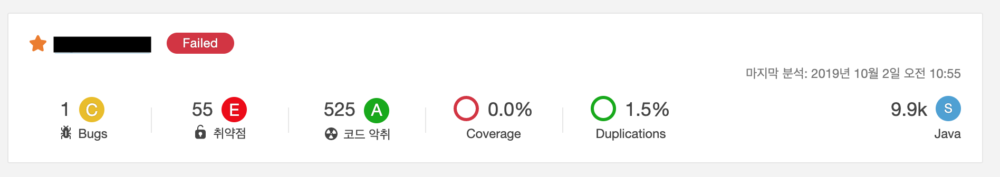
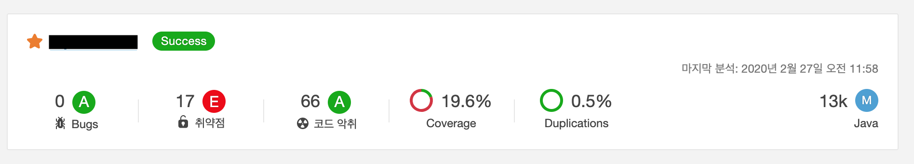

# 프로젝트를 이어받다.

저는 작년(2019년) 6월 말에 새로운 회사로 이직하였습니다. 첫 번째로 받은 업무는 새롭게 개발 중이던 관리자용 시스템을 이어받아 완성 시키는 것이었습니다. 기존에 개발자 한 분께서 맡아 개발해왔지만, 관리자용 시스템이라 우선순위가 다른 프로젝트들보다 낮아 꽤 오랜 기간 미완성 상태로 남겨졌던 프로젝트였습니다. 그러나, 이미 기존 시스템 기반으로 어느 정도 구현이 된 상태였고 실제 배포되어 일부 기능들은 업무 담당자들이 사용하고 있었습니다. 그렇기에 해당 프로젝트는 이미 작성된 코드량이 꽤 되었죠. 이 글에서는 제가 이어받은 프로젝트에 기능을 추가하며 완성하는 동시에 기존 코드들을 함께 개선한 경험을 공유하고자 합니다.

# 레거시 코드란?

앞서 말씀드렸다시피 제가 이어받은 프로젝트에는 이미 꽤 많은 양의 코드가 작성되어 있었습니다. 레거시 코드를 다양하게 정의할 수 있지만, 이 글에서는 아래의 이유로 기존에 작성된 코드들을 레거시 코드라고 칭하겠습니다. 2, 3번의 이유는 뒤에 소개해드릴 소스코드 정적 분석 툴인 SonarQube의 분석 결과로 확인할 수 있습니다.

1. 다른 사람이 "처음" 작성한 코드다.
2. 테스트 코드가 없었다.
3. JAVA의 Best Practice가 지켜지지 않았다. ('LocalDate' 대신 'Date' 사용 등)

저는 이 글에서 기존의 코드를 레거시 코드라 일컫고 있지만 1번의 이유로 기존 코드가 나쁜 코드라던가 코드를 작성한 분께 탓을 돌리든지 하는 생각은 하지 않습니다. 같이 업무를 하는 입장에서 기존에 코드를 작성하신 분은 굉장한 실력자십니다. 1번 이유에 '처음'이라는 단어를 강조하고 있는데요. 정보가 없는 상태에서 요구사항을 만족하는 기능을 '처음' 만들어 내는 것 자체가 굉장한 성과라고 생각하기 때문입니다. 제가 읽었던 책들 중 '프로그래머의 길, 멘토에게 묻다'라는 책에서 오픈소스를 읽는 것이 도움 된다는 내용을 소개하며 아래의 문장을 언급하고 있습니다.

> 소스가 별로 훌륭해 보이지 않아서 다소간 실망할 수도 있겠지만, **그 코드를 작성한 사람들은 도움 받을 커뮤니티 같은 것도 없이 모든 것을 새로 만들어 내야 하는 처지였음을 잊지 말아야 한다.** 소스를 보다가 버그를 발견했다면, 수정 패치를 만들어서 제작자에게 보내 보라.
>
> - 데이브 후버 외 1명, 『프로그래머의 길, 멘토에게 묻다』, 강중빈 옮김, 인사이트(2010), p72-73.

책에서는 레거시 코드를 대하는 태도에 대해서도 말하고 있는 것 같습니다. 레거시 코드를 만난다고 실망에 그칠 것이 아닌 적극적으로 개선 시키는 태도가 필요하다고 말이죠.

# 클린코드를 향해 가다.

SonarQube 환경을 제 노트북인 로컬 환경에 구축하다 보니 관리 미흡으로 프로젝트 초기 분석 결과가 지워졌습니다. 그렇지만 프로젝트가 진행되던 중반쯤인 10월경의 자료가 있어 현재의 분석 결과와 비교하여 보여드리겠습니다.

1. **2019년 10월 분석 결과**

2. **2020년 02월 분석 결과**

결과를 보시다시피 프로젝트의 규모는 31% 증가하여 'Small'에서 'Medium'으로 변경되었습니다. 미완성된 기능들을 개발했을뿐더러 새로운 요구사항이 지속해서 생겨나 규모가 커지게 되었죠. 그에 반해 'Bugs'는 사라졌고, 취약점도 38개가 줄어들어 기존보다 68% 감소하였습니다. 또한 코드 악취는 459개가 줄어들어 기존보다 87% 감소하였습니다. 그뿐만 아니라 테스트 커버리지는 0%에서 19.6%로 증가하였습니다. 테스트 코드는 새로운 기능을 개발할 때는 필수로 작성하고 있으며 틈틈이 기존 기능들에 대해서도 지속해서 작성하고 있습니다. 코드 중복도 1.5%에서 0.5%로 줄어들었네요.

요약하자면 프로젝트 규모는 기존보다 커졌지만, 코드 품질은 좋아졌습니다. 이 같은 결과는 새로운 코드들의 품질만 신경 써서 이루어진 것이 아닌 기존 코드들을 지속해서 가다듬었기에 가능했습니다. 돌이켜 보면 개선해온 과정이 항상 즐겁지만은 않았습니다. 때론 지루하고, 때론 흥미롭고, 때론 답답하고, 때론 고통스러웠고, 때론 상쾌했습니다. 확실한 것은 개인적인 성장에 큰 도움이 되었다는 것입니다. 이제, 제가 어떻게 코드들을 개선 시켰는지 간단히 소개해드리겠습니다. 모든 내용을 제가 설명하기에는 글이 너무나 길어질 것 같아 각 항목에 제가 참고한 글들을 링크해 두겠습니다. 좋은 글들을 작성해주신 모든 분께 감사의 인사를 드립니다.

# 스프링 레거시 코드를 개선하는데 실천한 13가지 방법

이제, 제가 프로젝트의 코드를 개선하는데 사용한 13가지 방법을 소개할 것인데요, 그 전에 프로젝트의 환경을 간단히 말씀드리면 좋겠네요. Spring4 기반의 웹 프로젝트로 SQL Mapper로 Mybatis를 사용하는 환경입니다. 이 글이 최신 SpringBoot2, JPA, Querydsl 등을 업무상 사용하지 못하는 분들께도 큰 도움이 되었으면 좋겠습니다.

## 1. 테스트 코드 작성

기존 코드에는 테스트 코드가 없었습니다. 특히, 코드 리팩토링을 진행할 때 테스트 코드가 필수라고 생각되어 최대한 작성하려고 노력하였습니다. 그리고 신규 추가되는 기능들에는 필수적으로 테스트 코드를 작성했습니다. 처음에는 의무적으로 테스트 코드를 작성하였는데요. 작성하다 보니 테스트 코드의 순기능에 대해 많이 공감하게 되었습니다. 프로그램을 재시작(톰캣 재시작 등)하지 않고 피드백을 받을 수 있다 보니 훨씬 안정적으로 코드를 작성할 수 있었습니다. 또한, 테스트 코드를 이리저리 돌려보며 프레임워크나 라이브러리의 내부 동작 원리에 대한 이해도도 높아졌습니다. 이제는 신규 라이브러리를 사용하게 될 때면 테스트 코드를 통해 테스트를 먼저 해보는 습관도 생긴 것 같네요. 물론, 아직 작성해야 할 테스트 코드가 많이 남았습니다.

> 참고: [소프트웨어 개발의 생산성, 그 어려움과 도전…](http://kwangshin.pe.kr/blog/2018/06/26/software-development-productivity-difficulties-and-challanges/)
>
> 참고: [Testing with Spring Framework 4.x](https://www.slideshare.net/SpringCentral/testing-with-spring-framework-4x)
>
> 참고: [Spring 공식 문서 - Testing](https://docs.spring.io/spring/docs/current/spring-framework-reference/testing.html#unit-testing)
>
> 참고: [How to Spring MVC Unit Test 스프링 MVC 단위 테스트](https://thswave.github.io/java/2015/03/02/spring-mvc-test.html)
>
> 참고: [spring mvc 에서 unit test 구현 (Controller, Service, DAO)](https://dreambringer.tistory.com/14)
>
> 참고: [Mixing JUnit 4 and JUnit 5 tests](https://igorski.co/java/junit/mixing-junit-4-and-junit-5-tests/)

이전까지 SpringBoot 환경에서만 테스트 코드를 작성해보다가 Spring4 환경에서 작성하려니 테스트 코드의 환경을 설정하는 것에서부터 어려움이 많았고 그만큼 시행착오도 많았습니다. 이제 테스트 코드의 형태가 안정되었는데요. 기회가 된다면 Spring4와 같은 레거시 환경에서 테스트 코드를 작성하는 방법도 공유할 생각입니다.

## 2. 단순히 값을 나타내는 객체가 아닌 역할을 갖는 객체로 변경

이전 코드들에서는 객체 중심의 코드가 아닌 데이터 중심의 코드가 많았습니다. 특히 객체들이 특별한 역할 없이 getter와 setter로 이루어진 경우가 많았죠. 객체들이 수행해야 할 것들이 객체 외부에서 getter와 setter를 통해 이루어지고 있었던 것입니다. 그래서 저는 다음의 활동을 통해 리팩토링을 해나갔습니다.

1. 단순히 값을 나타내는 VO 객체를 제거하였습니다.
2. 객체 외부에 존재하는 로직을 객체 내부로 옮겼습니다.
3. model 객체에 대한 테스트를 작성하였습니다.
4. 비슷한 역할을 갖고 있으면 interface를 통해 적극적으로 추상화를 하였습니다.
5. setter를 제거하였습니다.
   > 참고: [@Reuqest Body에서는 Setter가 필요없다?](https://jojoldu.tistory.com/407)
6. getter의 사용을 최소화 하였습니다.

관련해서는 제가 작성했던 글인 '[AWS도 Setter를 사용하지 않는다](https://sogoagain.github.io/2019/09/25/AWS도-Setter를-사용하지-않는다/)'를 참고하면 좋을 것 같습니다.

## 3. static 클래스를 Bean과 Component로 변경

기존 코드에 static 메서드만 존재하는 static 클래스가 많았습니다. 그런데, static 함수나 클래스는 사용하는 곳에서 의존성을 외부로 드러내지 않고 내부로 감추게 됩니다. 이는 마치 전역 변수, 전역 함수를 사용하는 것과 같은 문제가 발생하게 되죠. 변경의 여파를 파악하기 힘들어지며 복잡성이 증가합니다. 그래서 저는 static 클래스들을 Spring에서 지원하는 Bean과 Component로 변경하였습니다.

> 참고: [언제 static 함수 모음 Class를 만들어야 할까?](http://kwon37xi.egloos.com/4844149)
>
> 참고: [Are Helper Classes Evil?](https://docs.microsoft.com/ko-kr/archive/blogs/nickmalik/are-helper-classes-evil)
>
> 참고: [Killing the Helper class, part two](https://docs.microsoft.com/ko-kr/archive/blogs/nickmalik/killing-the-helper-class-part-two)

## 4. Controller, Service, Model의 계층 구조를 명확히

기존 코드에서 Controller에 비즈니스 로직이 있거나, Model에 있어야 할 로직이 Service에 있거나 하는 사항이 발견되었습니다. 저는 이러한 점들을 해결하기 위해 '3계층 구조(3 Tier)'에 근거하여 각각의 역할을 나름대로 정의하여 프로젝트를 진행하였습니다.

1. Controller는 Presentation 계층으로서 입력값 검증, Application 계층에서 필요한 객체를 준비, 결괏값을 요청한 곳에 반환하는 역할로 규정하였습니다.

   > 참고: [Validation in Spring Boot](https://www.baeldung.com/spring-boot-bean-validation)

2. Service는 Application 계층으로서 정보를 처리하고 원하는 결과를 만들어내는 역할로 객체들이 협력하는 장소라고 규정하였습니다.

3. Model은 domain의 비즈니스 로직을 구현하는 역할로 규정하였습니다.

## 5. Java의 Best Practice 적용

기존 코드는 Java의 Best Practice와 거리가 먼 코드들이 있었습니다. 특히 'LocalDate, LocalDateTime' 대신 'Date'와 'Calander'를 사용하여 시간 관련된 로직을 처리하고 있었죠. 이 밖에도 '정적 팩토리 메서드'와 같은 Effective Java에 나오는 실천 사항들이 지켜지지 않고 있었습니다. 뿐만 아니라 디자인 패턴의 활용도도 낮았습니다. 그래서 아래의 개선 활동을 하였습니다.

1. 'Date', 'Calander'를 'LocalDate', 'LocalDateTime'을 사용하도록 변경하였습니다.
2. Effective Java에 나오는 실천 사항을 지키며 점진적으로 개선하였습니다.
3. 팩토리 패턴, 전략 패턴 등 디자인 패턴을 활용 하였습니다.

## 6. Spring의 Best Practice 적용

기존 코드에서는 Spring을 사용할 때 Best Practice와는 거리가 먼 코드들이 몇몇 있었습니다. DI를 활용할 때 Field Injection을 활용하거나 Service에 불필요하게 1:1 매핑된 인터페이스가 존재하였죠. 그래서 이를 개선하였습니다.

1. Field Injection을 Constructor Injection으로 변경

   > 참고: [Field Dependency Injection Considered Harmful](https://www.vojtechruzicka.com/field-dependency-injection-considered-harmful/)
   >
   > 참고: [[Spring]필드 주입(Field Injection) 대신 생성자 주입(Constructor Injection)을 사용해야 하는 이유](https://zorba91.tistory.com/238)

2. 불필요하게 Service와 1:1 매핑된 interface 제거하고 필요한 interface를 추출

   > 참고: [Business Layer에 Interface를 만들어야 할까?](https://www.slipp.net/questions/19)

## 7. Annotation 전략

기존 코드에서 Lombok을 사용하고 있었습니다. 그런데, 대부분의 객체에 @Data와 @AllArgsConstructor 등의 사용을 자제해야 하는 Annotaion들이 작성되어 있었습니다. 그래서 @Data대신 @Getter만을 사용하도록 하는 등의 변경하였습니다. 최대한 변경의 여파가 크지 않도록 필요한 것들만 보수적으로 Annotaion을 적용하였죠. 그뿐만 아니라 객체들의 역할에 따라 어느 정도 Annotaion들이 일관성을 띠게 되어 나름대로 Annotaion 전략도 수립하였죠.

> 참고: [실무에서 Lombok 사용법](https://popit.kr/실무에서-lombok-사용법/)
>
> 참고: [Lombok 사용상 주의점(Pitfall)](https://kwonnam.pe.kr/wiki/java/lombok/pitfall)

## 8. Exception 전략

기존 코드에서도 ControllerAdvice를 이용하여 에러를 처리하고 있었습니다만, API 요청을 처리하던 중에 발생한 오류인지 페이지 요청을 처리하던 중에 발생한 오류인지 구분하지 않고 처리를 하고 있었습니다. 또한, 오류에 대한 상세 내용이 명확히 정의되어 있지 않아 개선하였습니다. 참고 글들을 참고해 나름의 Exception 전략을 세우고 Error 응답에 대해서는 통일된 형식의 응답을 반환하도록 개선했습니다.

> 참고: [Spring Guide - Exception 전략](https://cheese10yun.github.io/spring-guide-exception/)
>
> 참고: [Spring에서 @ControllerAdvice를 활용한 Exception 처리](https://www.slipp.net/questions/600)
>
> 참고: [Spring: Different exception handler for RestController and Controller](https://stackoverflow.com/questions/43325685/spring-different-exception-handler-for-restcontroller-and-controller)

## 9. Logging 정책

기존 코드는 서로 다른 Controller마다 메서드에서 비슷한 유형의 로깅 관련 코드가 중복되어 존재하였습니다. Controller 도입부에는 넘어온 파라미터를 로깅하고 처리가 끝났을 때는 반환하는 값을 로깅하고 있었죠. 저는 Spring의 큰 장점인 AOP를 활용하여 Controller 단의 로깅을 공통으로 처리하도록 개선하였습니다.

> 참고: [Spring AOP 스프링이 해줄건데 너가 왜 어려워 해? Spring boot에서 aop logging 사용법 제일 쉽게 알려드립니다!](https://jeong-pro.tistory.com/171)
>
> 참고: [Spring4 AOP 간단한 사용예제](https://blog.azulpintor.io/entry/spring4-aop-usage-example-simply)
>
> 참고: [AOP 설정을 활용한 세션체크 AOP Session Check](https://aljjabaegi.tistory.com/278)
>
> 참고: [Logging aspect in RESTful web service – spring aop (log requests/responses)](https://makeinjava.com/logging-aspect-restful-web-service-spring-aop-request-response/)

## 10. Mybatis 연관 관계 매핑 사용

제가 맡은 프로젝트가 JPA를 사용하지 않는 환경이라 아쉬움이 많았습니다. Mybatis는 SQL의 결과를 객체에 할당해주기는 하지만 JPA의 Entity 개념이 아니기 때문에 객체들과의 연관관계나 객체의 동일성 등을 표현하는 데 어려움이 있었기 때문입니다. 그래도 저는 기존 환경에서 최대한 개선을 해보고자 JPA와 비슷하게 매핑하려고 노력하였습니다. 특히, 기존 코드는 연관 관계 매핑을 활용하고 있지 않았습니다. 저는 Mybatis에서 제공하는 연관 관계 매핑을 적극적으로 사용하여 객체지향 적으로 코드를 작성하기 위해 노력했습니다. 물론, JPA에서 제공하는 것처럼 객체 그래프가 완벽하진 않지만 나름대로 만족하며 사용하고 있습니다. JPA보다 개발 공수가 더 든다는 것이 굉장히 아쉽습니다.

> 참고: [Mapper XML 파일](https://mybatis.org/mybatis-3/ko/sqlmap-xml.html)
>
> 참고: [MyBatis One to One Mapping](http://vincent4chen.com/mybatis/install/MyBatis-One-to-One-Mapping/)

연관 관계 매핑을 적용하던 중 Enum 매핑을 할 때 애를 먹었습니다. 예를 들면 DB에 0이 저장되어 있을 때 'ProductType'의 'Phone'이 매핑되고 1이 저장되어 있을 때 'ProductType'의 'Pad'가 저장되는 식의 구현이죠. Type Handler를 구현하여 문제를 해결했는데 그 과정에서 다음의 글이 큰 도움을 주었습니다.

> 참고: [Proposal for an enum type handler which persists specified value rather than ordinal or name.](https://github.com/mybatis/mybatis-3/issues/42)

연관 매핑을 사용하기 위해서 Mybatis 공식 문서를 자세히 읽게 되었는데요. 이때 Mybatis 번역과 관련되어 이슈를 제기하기도 하였네요. 어쩌다 보니 오픈 소스 프로젝트에 첫 이슈를 제기해보는 경험도 하게 되었습니다.

> [The contents of the 'caption' tag are garbled In the Korean translation document](https://github.com/mybatis/mybatis-3/issues/1602)

## 11. 비동기 로직 활용

제가 작성한 글 '[AWS도 Setter를 사용하지 않는다](https://sogoagain.github.io/2019/09/25/AWS도-Setter를-사용하지-않는다/)'에서도 간단히 언급한 적이 있지만, 기존 코드에서는 외부 API를 호출하고 수행하는 로직들이 동기 방식으로 구현되어 있어 처리 속도 면에서 불리한 점들이 있었습니다. 외부 API를 호출하는 로직 중 비동기로 전환할 수 있는 것들에 대해서 적극적으로 비동기로 전환하였습니다. 이렇게 개선하는 중에 @Async와 @Transactional을 동시에 사용할 수 없다는 것도 알게 되었죠. 그래서 API 호출하는 Service와 DB 작업을 하는 Service를 분리하였습니다. API 호출하는 서비스에서 DB 작업을 하는 서비스를 호출하여 로직을 처리하도록 구현했습니다.

> 참고: [spring transaction을 활용해 async로 데이터를 처리할 때의 이슈](https://www.slipp.net/questions/123)

## 12. 정적 소스 코드 분석 툴 도입

제 나름대로 제가 갖고 있던 지식과 인터넷에서 얻은 지식 그리고 주변 사람들로부터 얻은 지식을 종합해 프로젝트를 개선하고 있었습니다. 그런데, 정말로 제가 가는 길이 올바른 길인지 의문점이 들었습니다. 그때 소스코드를 정적으로 분석해주는 툴을 알게 되었고 그러한 프로그램 중 하나인 SonarQube를 docker를 활용해 제 로컬 환경에 구축하였습니다. IDE인 IntelliJ와 연동하여 실시간으로 제가 작성한 코드에 문제가 없는지 확인하고 있으며 개발이 끝나면 코드 분석을 돌려 코드 품질이 어떤지 확인하며 피드백을 받고 있습니다.

> 참고: [소나큐브(Sonarqube)를 통한 코드 분석 및 코드 품질 향상](https://daddyprogrammer.org/post/817/sonarqube-analysis-intergrated-intellij/)
>
> 참고: [SonarQube 이용해서 만드는 CI](http://www.chidoo.me/index.php/2016/03/21/sonarqube-for-ci/)
>
> 참고: [sonar-coverage-example-java](https://github.com/screwdriver-cd-test/sonar-coverage-example-java)

## 13. 도메인 기반 패키지 구조

기존 코드는 기능 중심의 계층형 패키지 구조로 되어 있었습니다. Controller들은 controller 패키지에, Service들은 service 패키지에 위치한 모습이었죠. 처음에는 큰 문제가 없었으나 프로젝트의 크기가 커지고 각각의 요소들이 많아지게 되자 문제가 발생했습니다. 저는 특정 도메인과 관련된 코드를 수정하고 싶을 뿐인데 도메인과 관련된 클래스 파일들이 흩어져있어기에 관련된 클래스들만 찾는데도 큰 노력이 들었습니다. 또한, 이전 코드는 하나의 Controller에서 여러 도메인에 대해 처리를 하기도 하였습니다. 이대로 가면 안 되겠다 싶어 개선을 진행했습니다.

일단, 여러 도메인이 섞여 있는 Controller와 같은 클래스들에 대해서 도메인 별로 분리하였습니다. 그리고 전체 디렉터리 구조를 도메인 기반으로 변경하였죠. 이렇게 구조를 변경하니 개발뿐만 아니라 차후 유지보수를 하는 데도 편하였습니다. 기능 하나를 수정하기 위해 여러 클래스를 찾아다니는 노력이 많이 줄었죠.

> 참고: [Spring Guide - Directory](https://cheese10yun.github.io/spring-guide-directory/)
>
> 참고: [spring-petclinic](https://github.com/spring-projects/spring-petclinic)

# 회고

긴 글이 될 것이라 예상은 했기에 감안하고 최대한 축약하여 표현하였습니다. 그런데도 예상을 뛰어넘는 긴 글이 되어 버렸네요. 글에서는 각각의 항목을 몇 줄로 표현하였지만, 당시 저는 각각의 항목을 개선하기 위해 고민과 노력을 굉장히 많이 하였습니다. 생각보다 쉽지 않더라고요. 솔직히 고통스러웠습니다. 중간에 '포기하고 기존 코드들을 유지한 채로 개발을 진행할까?'라는 고민을 수도 없이 했습니다.

하지만 개발자라면 해야 하는 일이라고 생각하여 참고 진행했습니다. 모두가 언제나 완벽히 클린한 코드를 원하지만, 현실은 누군가 '처음' 작성한 코드를 이어받고 서비스를 운영하는 입장에 놓이게 되니까요. 이번에 제가 제 나름대로 개선했다고 생각하는 코드도 누군가에게는 레거시 코드로 느껴지리라 생각합니다. 어쩌면 이번 경험을 평생 해나가야 하는 게 개발자가 아닌가 생각도 해봅니다. 고통스러운 과정이었지만 개선된 모습을 보고 나니 너무나 뿌듯하네요. 특히 SonarQube를 통해 확연히 변한 결과를 보니 더욱더 뿌듯했습니다. 개선하면서 배운 것도 참 많았다는 생각도 합니다. 위 개선 사항 중 하나만 꼽으라면 저는 '테스트 코드 작성'을 꼽겠습니다. 아직 테스트 코드를 작성해보지 않으신 다른 개발자분들도 시도해 보셨으면 합니다. 피드백을 필요할 때 빠르게 받으니 장점이 많았습니다.

물론, 아직 가야 할 길이 많습니다. 개선하고 싶은 부분도 많고요. 개선을 진행할 때마다 제가 수정하는 방향이 옳은 것인지 확신을 가지려고 자료 참고도 많이 하였습니다. 그런데도 부족한 점이나 잘못된 부분들이 있을 것입니다. 혹시나 다른 생각을 하고 계신 분들은 의견 공유해주시면 그것을 피드백 삼아 더 나은 코드를 작성하는 데 노력하겠습니다. 긴 글인데 여기까지 읽어주셔서 감사합니다.
