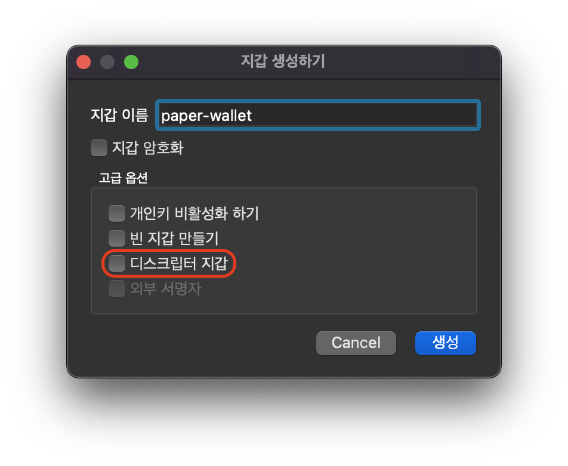
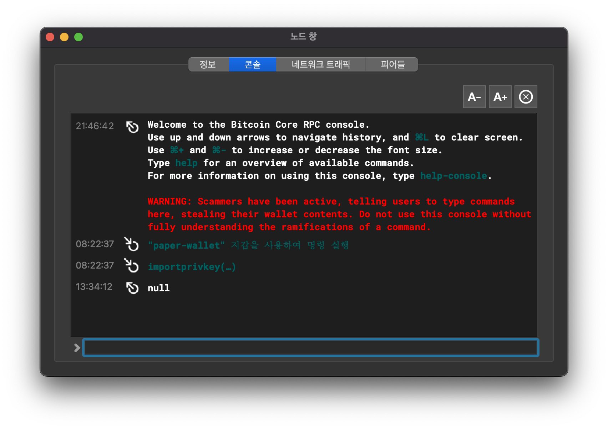

# Not Your Keys, Not Your Bitcoin

최근 세계 3위 가상화폐 거래소인 FTX가 파산 신청을 하면서 개인키의 중요성이 대두되고 있다. FTX 사태로 인해 비트코인을 거래소에 두면 잃어버릴 수 있다는 인식이 퍼졌고 그 결과 많은 사람이 매수한 비트코인을 거래소에서 개인 지갑으로 옮기고 있다. 비트코인은 제3자 신뢰가 필요 없는 시스템이기 때문에 개인키로 직접 비트코인을 보관하는 것이 무척 중요하다. 이 글에서는 '종이지갑'과 'Bitcoin Core' 클라이언트를 이용해 제3자 신뢰를 최소한으로 가져가며 비트코인을 이용하는 방법에 대해 소개하겠다.

## 종이지갑

제3자 신뢰를 최소화하면서 안전하게 개인키를 보관하는 방법 중 대표적인 형태가 종이지갑이다. 종이지갑은 말 그대로 종이에 주소와 개인키를 인쇄한 것이다. 종이가 찢어지거나 화재 등의 재해로 훼손되면 복구하기 어렵다는 단점이 존재하지만 직접 개인키를 생성하여 손쉽게 제작할 수 있다는 점과 상대적으로 온라인 해킹 위협에 안전하다는 점 등으로 인해 여전히 많은 사람이 활용하고 있다. [비트코인 - 키와 주소](/posts/2022/bitcoin-key-address/) 포스트에서 종이지갑에 대해 간단히 살펴보았다. 종이지갑은 크게 다음의 두 가지 방법으로 제작할 수 있다.

### 1. 코딩

코드를 작성할 수 있다면 직접 비트코인의 키와 주소를 생성하는 프로그램을 개발해 종이지갑을 제작할 수 있다. 나는 `Go` 언어로 개인키부터 비트코인 주소까지 생성하는 코드를 작성하였다. 개인키와 주소를 QR 코드로 나타내어 프린터로 종이에 인쇄하면 완성이다.

- [bitcoin-key-to-address.go](https://gist.github.com/sogoagain/5f77ac6d6c023551aeb4b80f6b9909d3#file-bitcoin-key-to-address-go)

> 주의: 위 코드는 자신의 책임하에 참고용으로만 사용하길 바란다.

### 2. 종이지갑 생성 사이트 이용

코드를 작성하기 어렵다면 [bitaddress.org](https://www.bitaddress.org/)와 같이 코드가 공개되어 신뢰할만한 종이지갑 생성 사이트를 이용할 수 있다. 온라인 환경이라 생성된 키가 네트워크를 통해 유출되는 일이 걱정이라면 페이지를 연 뒤 Wifi 등의 네트워크를 차단한 상태에서 종이지갑을 생성하자. 혹시 사이트에 배포된 코드가 오염되었을까 걱정이라면 직접 GitHub에서 [bitaddress.org 소스코드](https://github.com/pointbiz/bitaddress.org)를 다운받아 로컬에서 실행하자. 코드를 다운받은 뒤 `bitaddress.org.html` 파일을 브라우저로 열면 로컬에서 사이트를 실행할 수 있다.

# Bitcoin Core

직접 제작한 종이지갑으로 비트코인을 전송하는 것은 거래소의 출금 기능을 이용하면 손쉽게 할 수 있다. 그러나, 종이지갑에 담긴 비트코인을 다른 주소로 이체하고자 한다면 어떻게 해야 할까? 종이지갑을 이야기했을 때 가장 많이 접한 질문이다. 비트코인을 이체하기 위해선 개인키를 사용해야 하므로 신뢰할만한 클라이언트가 필요하다. 개인적으로 'Bitcoin Core' 사용을 권장한다.

## 비트코인 시스템의 참조구현

'Bitcoin Core'는 최초 사토시 나카모토가 개발한 비트코인의 참조 구현체다. 참조 구현체라는 말은 여러 비트코인 소프트웨어 개발에 기준이 된다는 뜻이다. 'Bitcoin Core'의 변경 사항을 통해 비트코인 프로토콜이 변경되며 다른 비트코인 소프트웨어들은 변경된 'Bitcoin Core' 구현을 참고해 변경 사항을 반영한다. 즉, 'Bitcoin Core'는 비트코인의 표준이라 볼 수 있으며 가장 권위 있고 신뢰할 수 있는 클라이언트다. 'Bitcoin Core'를 설치하고 이를 이용해 종이지갑에 보관된 비트코인을 이체해보며 'Bitcoin Core'의 기본적인 사용법을 살펴보자.

## 설치 방법

'Bitcoin Core'는 macOS, Windows, Linux를 지원한다. 이 글에서는 macOS 환경을 예시로 설명하겠다.

### 1. 설치 파일 다운로드

'Bitcoin Core' 설치 페이지에 접속한다.

- [Bitcoin Core - Download](https://bitcoincore.org/en/download/)

그 후 아래 이미지에서 빨간 박스로 표시한 총 3개의 파일을 동일한 경로에 다운로드한다.

1. 설치 파일: `bitcoin-${version}-x86_64-apple-darwin.dmg`
2. 설치 파일별 체크섬 값: `SHA256SUMS`
3. 체크섬 파일의 PGP 서명 값: `SHA256SUMS.asc`


### 2. 설치 파일 검증 (권장사항)

신뢰할만한 'Bitcoin Core' 공식 사이트에서 설치 파일을 받았기 때문에 믿고 바로 실행해도 괜찮을까? 그보단 설치 파일이 훼손되었거나 변조되진 않았는지 검증하는 것을 권장한다. 아래의 단계를 통해 다운로드한 설치파일을 검증할 수 있다.

1. 설치 파일의 `checksum`이 `SHA256SUMS` 파일에 포함되어 있는지 확인한다. 포함되어 있다면 출력값 중 설치 파일명 옆에 `OK`라고 출력될 것이다.

```shell
shasum -a 256 --check SHA256SUMS
```

2. `GNU Privacy Guard (GPG)`를 설치한다.

```shell
brew install gnupg
```

3. 'Bitcoin Core'를 빌드하는 개발자들의 PGP 키들을 받아오자. 아래 목록에서 신뢰할 수 있는 몇몇 개발자들의 키를 받아오면 된다. 신뢰도를 높이고 싶다면 목록에 포함된 모든 키를 받아오자.

  - ['Bitcoin Core' 개발자들의 PGP 키 목록](https://github.com/bitcoin/bitcoin/blob/master/contrib/builder-keys/keys.txt)

```shell
gpg --keyserver hkps://keys.openpgp.org --recv-keys ${builder-key}
```

4. 받아온 PGP 키들을 이용해 설치 파일을 확인하는 데 사용한 체크섬 파일의 유효성을 증명하는 서명을 확인한다. 아래 명령어를 실행한 출력값에 `gpg: Good signature`로 시작하는 문장이 있다면 서명이 검증된 것이다. 또한, `Primary key fingerprint: E777 299F C265 DD04 7930  70EB 944D 35F9 AC3D B76A`와 같이 출력되는 `fingerprint`가 서명자의 공개키와 일치하는지 확인하자.

```shell
gpg --verify SHA256SUMS.asc
```

### 3. 설치

다운로드받은 설치 파일에 문제가 없다는 것을 검증했다면 설치 파일을 실행시켜 'Bitcoin Core' 클라이언트를 `Applications` 폴더에 설치하자.


### 4. 초기 설정

최초 실행 시 비트코인의 블록체인 사본을 어디에 얼마나 저장할 것인지 설정하는 창이 출력된다. 'Bitcoin Core'는 풀노드 클라이언트다. 따라서 글을 작성하고 있는 현재 기준으로 약 `500GB` 정도 크기의 블록체인 데이터를 저장할 수 있는 공간이 있어야 한다.

아래 이미지에서 보듯 블록체인 저장 영역을 제한하는 `pruning` 옵션을 사용할 수 있지만 이 옵션을 활성화하여도 최초 한번은 모든 블록체인 데이터를 받아와야 한다. 문제는 블록체인 데이터를 받아온 뒤 외부에서 생성한 키를 불러왔을 때 과거 블록 데이터가 지워졌기 때문에 해당 키가 보유한 비트코인 잔액을 알 수 없다. 잔액을 확인하기 위해선 다시 모든 블록체인 데이터를 받아와야 한다. 이러한 점으로 인해 'Bitcoin Core'는 모든 장부를 갖는 풀노드로 활용하는 것을 권장한다.

제3자를 신뢰하지 않는 것이 비트코인의 핵심이기에 사용자가 비트코인 장부를 가지고 있는 것은 어쩌면 당연하다. 내가 가진 장부만이 신뢰할 수 있는 유일한 장부이기 때문이다.


### 5. 비트코인 네트워크와 동기화

설정이 완료되면 비트코인 네트워크에서 2009년 1월 3일에 생성된 제네시스 블록부터 가장 최근의 블록까지 데이터를 받아오며 검증하기 시작한다. 내 맥북으로는 동기화가 완료되는데 약 하루 정도의 시간이 소요되었다.


## 종이지갑에 보관한 비트코인 이체하기

비트코인 네트워크와 동기화가 완료되었다면 설치가 끝난 것이다. 이제 종이지갑에 보관한 비트코인을 다른 주소로 이체해 보자.

### 1. 지갑 생성하기

`파일 > 지갑 생성하기...` 메뉴를 통해 종이지갑의 키를 불러올 지갑을 생성한다. 종이지갑을 불러올 때 `importprivkey` 명령어를 사용할 예정이라 지갑 생성 시 `디스크립터 지갑` 옵션에 체크를 해제하자. 그 이유에 대해선 아래의 이슈를 참고하길 바란다.

> 참고: [[bitcoin/bitcoin#23946] importprivkey - This type of wallet does not support this command](https://github.com/bitcoin/bitcoin/issues/23946)



지갑이 생성되면 아래와 같이 'Bitcoin Core' 메인 화면에 지갑 잔액이 출력된다. 아직 종이지갑을 불러오지 않았기 때문에 잔액은 `0 BTC`다.


### 2. 종이지갑 불러오기

`창 > 콘솔` 메뉴를 통해 콘솔 창을 연다. `importprivkey` 명령어를 이용해 종이지갑의 개인키를 'Bitcoin Core'에서 생성한 지갑으로 불러올 것이다. 아래의 명령어를 콘솔 창에 입력하자. `라벨`에는 향후 관리를 위해 해당 종이지갑을 쉽게 구분할 수 있는 별칭을 적어주면 된다.

```shell
importprivkey "${종이지갑의 개인키}" "${라벨}"
```

명령어를 입력하면 새로 불러온 개인키와 관련 있는 거래를 찾기 위해 로컬에 있는 장부를 훑으며 탐색한다. 재탐색에는 약 5시간이 소요되었다. 재탐색이 완료되면 콘솔에 `실행 중...` 메시지가 `null`로 바뀐다. 그리고 `개요` 화면에서 종이지갑의 비트코인 잔액 및 최근 거래내역을 확인할 수 있다.




### 3. 이체하기

`보내기(S)` 메뉴로 이동하자. `송금할 대상`에 비트코인을 이체할 주소를 입력하고 `금액`에 전송할 수량을 입력한다. 입력을 완료한 뒤 `보내기` 버튼을 클릭하면 생성할 트랜잭션을 검토하는 확인 창이 뜨는데 내용을 확인하여 이상 없다면 `보내기` 버튼을 누르자. 이제 거래가 생성되어 네트워크에 전파되었다. 즉 이체를 완료한 것이다. 향후 채굴자가 해당 거래를 블록에 포함해 채굴할 것이고 우리는 시간을 두고 컨펌되기만을 기다리면 된다.


# 기본으로 돌아가기

지금까지 종이지갑과 'Bitcoin Core'를 활용해 제3자 신뢰를 최소화한 비트코인 이용법을 살펴보았다. 현재 많은 기업에서 편리한 사용법을 제공하는 다양한 종류의 비트코인 지갑을 제작해 판매, 제공하고 있다. 이런 상황에서 편리한 방법을 제쳐두고 번거롭게 직접 키를 생성하고 이를 종이로 출력한 뒤 모든 장부를 다운로드하는 클라이언트를 이용할 필요가 있을까?

## 중앙 신뢰와 귀납법적 오류

FTX와 같은 중앙화 시스템은 평상시에 잘 작동하기 때문에 간편하게 이용할 수 있다. 특히, 시스템을 이용하다 문제가 생기면 고객센터에서 문제를 해결해주니 마음까지 편안해진다. 나를 믿느니 세계 3위의 거대한 거래소를 믿는 게 합리적이란 생각이 든다. 하지만, 이번 FTX 파산 사태로 중앙화 시스템은 단 한 번의 사건으로 모든 것이 무너지며 나의 자산이 모두 증발해버릴 수 있다는 것이 확인되었다. 즉, '지금까지 그랬으니 앞으로도 그럴 것'이라고 과거 경험을 토대로 미래를 예측하여 중앙화 시스템을 신뢰하는 것은 귀납법적 오류에 빠지는 것이다. 지금까지 잘 작동했다는 점이 내일도 잘 작동할 것이라는 사실을 보장해주진 못한다.

### 기업이 제작하는 비트코인 지갑의 중앙 신뢰 문제

하드월렛을 포함하여 기업에서 제작하고 배포하는 비트코인 지갑 역시 귀납법적 오류를 벗어날 수 없다. 기업이 생산한 제품을 사용한다는 것은 기업을 신뢰해야 하는 지점이 존재할 수밖에 없기 때문이다. 예를 들어 하드월렛에 올라간 소프트웨어가 생산과정에서 훼손되지 않았는지 어떻게 검증할 수 있을까? 하드월렛에서 생성하는 개인키는 암호학적으로 안전한 난수로 생성되는 것이 맞을까? 하드월렛에서 보여주는 잔액은 다른 사람의 장부를 참조해 보여주는 것인데 그 값을 믿을 수 있을까?

## Trustless system

중앙화된 시스템을 사용하게 된다면 어떻게 그 기업과 시스템을 신뢰할 수 있을지 질문을 던져보면 좋다고 생각한다. 그리고 이 질문의 끝은 비트코인의 본질을 가리키고 있다. 나 역시 하드월렛을 이용하고 있는 입장에서 이번 사태를 통해 비트코인의 본질에 대해 다시 생각해보는 계기가 되었고 종이지갑과 'Bitcoin Core' 풀노드의 중요성을 실감하였다. 당연하게도 자신 이외의 제3자는 신뢰하기 어렵다. 비트코인은 모두를 신뢰하지 않음으로써 신뢰를 보장하는 신뢰 시스템이다. 지금 그 근본을 돌이켜 볼 때다. 오직 나 자신만 믿는 상태에서 비트코인을 이용해보자. 그것이 비트코인의 힘이다.

# 참고문헌

- [FTX 파산에 발 동동…비중 큰 한국인, 돈 찾을 수 있나](https://news.sbs.co.kr/news/endPage.do?news_id=N1006970464)
- [페이퍼월렛](http://wiki.hash.kr/index.php/%ED%8E%98%EC%9D%B4%ED%8D%BC%EC%9B%94%EB%A0%9B)
- [비트코인 코어](https://ko.wikipedia.org/wiki/%EB%B9%84%ED%8A%B8%EC%BD%94%EC%9D%B8_%EC%BD%94%EC%96%B4)
- [귀납법의 오류](https://www.kihoilbo.co.kr/news/articleView.html?idxno=668591)
- [콜드월렛](http://wiki.hash.kr/index.php/%EC%BD%9C%EB%93%9C%EC%9B%94%EB%A0%9B)
