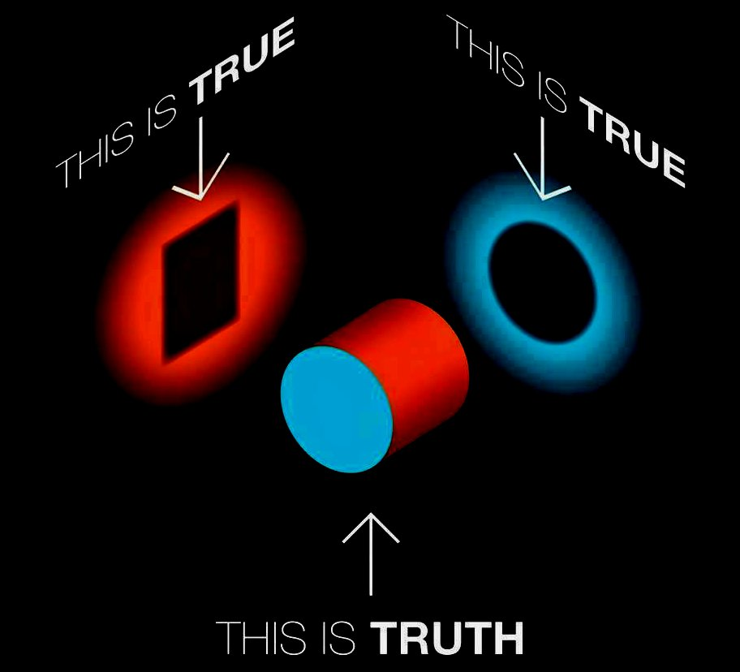
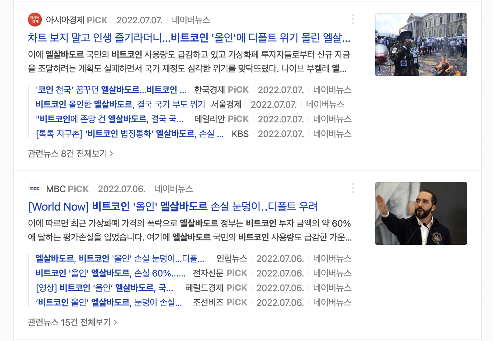

# 들어가며

## 비트코인을 깨닫다.

작년 2021년 하반기 비트코인 가격이 하늘 무서운 줄 모르고 오르고 있을 때 비트코인에 관심이 가기 시작했다. '도대체 무엇이길래 저렇게 비싼 걸까?' 정부와 경제 전문가 그리고 언론에선 사기라고 떠드는 데 가격은 계속해서 올라갔다. 그리고 없어진다는 말만 10년째 들어왔는데, 없어지기는커녕 계속 비싸지고만 있었다. 단순히 투기 자산이라 비싸다는 말에는 납득이 가질 않았다. '비트코인에 무언가 있는 것이 분명하다.'라고 생각한 뒤 비트코인을 알아보고 공부하기 시작했다. 공부를 시작한 지 얼마 지나지 않아 비트코인은 인류 문명사적으로 굉장히 중요한 사건이라는 결론에 도달했다. 비트코인이 중요하다는 것을 깨달은 날을 아직도 잊지 못한다. 그날은 심장이 너무 빨리 뛰어 잠을 제대로 청하지 못하였다. 이 놀라운 발명품이 어떤 미래를 가져올지 상상하며 밤을 지새운 기억이 선명하다.

## 기여 그리고 공유

비트코인의 매력에 빠지다 보니 [bitcoin core 프로젝트에 작지만 두 번의 기여](https://github.com/bitcoin/bitcoin/pulls?q=is%3Apr+is%3Aclosed+author%3Asogoagain)도 하게 되었다. 또한, 주변 사람들에게 비트코인을 알리기 시작했다. 비트코인이 대단하단 것을 내게 알려준 사람이 없었던 것이 아쉬웠기에 가만히 있을 수 없었다. 그러나 비트코인 이야기를 꺼내면 대다수 사람은 기존에 쌓여있던 오해들과 좋지 못한 인식들 때문에 비트코인의 본질을 제대로 보지 못했다. 특히, 10년 전 비트코인 포럼에서 이미 논의가 되고 사토시 나카모토가 답을 하여 결론이 내려진 사실들에 관해서도 잘못된 오해들이 반복적으로 나왔다. 그래서 이러한 오해들을 바로잡고 비트코인을 제대로 설명하기 위해 최근 회사에서 팀원분들을 대상으로 비트코인 세미나를 자진해서 진행했다. 이 글은 팀에서 진행했던 세미나 내용을 바탕으로 작성하고자 하며 아래의 목차로 구성된다.

1. 왜 비트코인인가?
2. 키와 주소
3. 지갑
4. 거래
5. 비트코인 네트워크
6. 블록체인
7. 채굴과 합의
8. 끝으로

먼저 첫 번째 주제인 '왜 비트코인인가?'에 대해 다루며 우리가 비트코인을 탐구해야 할 이유에 대해 알아보자.

# 비트코인은 비트코인

'블록체인은 좋고 비트코인은 나쁘다.', '비트코인은 화폐인가?', '비트코인은 금인가?' 이러한 문장들을 많이 들어봤을 것이다. 그러나 이러한 문장들이 비트코인을 제대로 설명할 수 있을까? 비트코인은 세상에 없던 완전히 새로운 것이다. 우리 인간들은 각자가 가진 관념이란 틀을 통해 사물을 보기 때문에 새로운 현상을 이미 경험했던 것에 빗대어 이해하는 것은 어쩌면 당연하다. 그러나, 이렇게 관념의 틀로 세상을 바라본다면 새로운 사물을 있는 그대로 보지 못한다.

*[It Is Not True Or It Is True](https://davidmmasters.com/blog/it-is-not-true-or-it-is-true/)*

위의 그림을 보면 사물에 빛을 어떻게 비추는가에 따라 벽에 맺히는 그림자의 형태가 달라진다. 왼쪽으로 빛을 비추면 사각형, 오른쪽으로 빛을 비추면 원이 보인다. 벽에 맺힌 사물의 모습이 사물의 진짜 모습을 보여주는가?

다시 비트코인으로 돌아오자. 비트코인은 이전에는 없던 새로운 것이라고 말하였다. 왜 그런지에 대해서는 차차 같이 공부해나가면 자연스럽게 알게 될 것이다. 세상에 없던 새로운 것인데 이미 있었고 경험했던 것들로 설명할 수 있을까? 이렇게 접근한다면 위의 그림처럼 벽에 맺힌 그림자만 볼 수 있을 뿐 새로운 것의 진짜 모습을 보지 못한다. 즉, 우리는 비트코인을 비트코인으로 보아야 한다. 비트코인은 기존의 화폐, 금으로 설명할 수 있는 것이 아니다. 그렇기 때문에 비트코인 그 자체를 공부하고 탐구할 필요가 있다.

# 비트코인은 화폐 현상이다.

## 비트코인이 세상에 출현한 지 13년... 우리는 비트코인을 외면해왔다.

비트코인이 세상에 출현한 지도 벌써 13년이 흘렀다. 꽤 오랜 시간이 지났음에도 아직도 우리는 비트코인을 외면하고 있다. 누군가 이것으로 부자가 되어서 반감을 품는 것일 수도 있고 우리의 관념을 지배하고 있는 경제 체제를 뒤집을 수 있다는 두려움으로 피하는 것일 수도 있다. 이유야 어찌 되었든 비트코인에 대해 사기라고 말하는 많은 사람들이 정작 비트코인에 대해 아무것도 모르는 것을 보면 많은 사람이 비트코인 현상 그 자체를 외면하고 있는 것이 현실이라 볼 수 있다. 그런데, 비트코인은 화폐 현상이다. 그리고 화폐 현상은 우리의 삶과 밀접하게 연관되기 때문에 정말 중요하다.

## 선조들의 화폐에 대한 안타까운 태도

왜 화폐 현상이 중요할까? 우리의 역사에서 쉽게 찾을 수 있다. 조선시대 우리의 선조들은 '은'을 제련하는 혁신적인 기법인 '회취법'을 개발하였다. 당시 세계 기축통화로 '은'이 사용되던 시기였기에 이 기술은 굉장히 중요했다. 그런데 얼마 지나지 않아 명나라가 은을 조공품으로 달라고 할 것이 두려워 은광을 폐쇄하고 은 채굴을 법으로 금지했다. 화폐 기술을 스스로 버린 것이다. 이 선택의 결과는 참혹했다. 혁신적인 은 제련 기법인 회취법은 일본으로 전해졌고 이를 잘 활용한 일본은 전 세계 은의 3분의 1을 생산하며 전 세계 2위의 은 생산국이 되었다. 은광을 개발해 막대한 부를 쌓고 전비를 축적한 일본은 조선을 상대로 전쟁을 일으키는데 이 전쟁이 '임진왜란'이다. 화폐를 외면하여 생긴 아픔이 과거에만 남아있는 것이 아닌 현재에도 지속되고 있다. 회취법은 조선에서 탄생하였지만, 유네스코 세계 문화유산으로 등재된 회취법 광산은 일본에 있다.

*'비트코인 엘살바도르' 네이버 검색 결과*

화폐 현상을 외면하면 큰 대가를 치러야 함을 역사에서 배울 수 있었다. 지금의 우리는 다르다고 말할 수 있을까? 위 이미지는 비트코인을 법정화폐로 채택한 엘살바도르에 대한 네이버 검색 결과 중 일부다. 엘살바도르가 어떠한 이유로 또 어떠한 과정으로 비트코인을 법정화폐로 채택했는지, 비트코인 매입은 어떻게 이루어졌는지, 비트코인을 법정화폐로 채택함으로써 얻는 이득은 무엇인지, 어떠한 미래를 그리고 있는지 등의 내용을 찾기는 굉장히 어렵다. 대부분 '대통령이 투기한다.', '비트코인 가격이 내려가 손해가 막심하다.', '애초에 말도 안 된다. 손해 볼 줄 알았다.' 등의 조롱 섞인 내용들만 찾을 수 있다. 비트코인 가격이 내려가 손실을 본 엘살바도르보다 화폐 현상에 대한 진지한 고민 없이 외면하고 조롱하는 한국의 현실이 더욱 안타깝지 않은가. 역사를 거울삼아 지금에서라도 화폐 현상인 비트코인에 대해 진지하게 생각해보아야 한다.

# 비트코인은 와해성 혁신이다.

## 와해성 혁신

와해성 혁신이란 업계를 완전히 재편성하고 시장 대부분을 점유하게 될 신제품이나 서비스를 일컫는다. 비트코인은 명백히 금융에서의 와해성 혁신이다. 비트코인은 우리가 사용하는 원화, 달러 등의 명목화폐나 금 등의 그 어떠한 자산 및 금융 시스템보다 우위에 있다. 비트코인은 레거시 금융이 하지 못하는 것을 하고 있기 때문이다.
> 현재의 금융 시스템과 비트코인을 비교하면 현재의 금융 시스템이 뒤떨어지는 점이 많기 때문에 앞으로 현재의 금융 시스템을 '레거시 금융'이라 칭하겠다.

러시아와 우크라이나의 전쟁으로 많은 사람이 비트코인이 와해성 혁신이라는 것을 경험과 관찰로 깨닫고 있다. 전쟁으로 금융망이 마비된 환경 속에서 우크라이나 국민들이 피난으로 국경을 넘을 때 비트코인을 사용했기 때문이다. 레거시 금융은 마비되었지만, 비트코인을 살아있었다. 또한, 전쟁 환경이 아니라 해도 레거시 금융 시스템을 이용해 자산을 국경 너머로 전달하는 것은 쉬운 문제가 아니다. 하지만 비트코인은 애초에 국경의 개념이 존재하지 않기 때문에 이를 아무렇지 않게 해낸다.

굉장히 중요하기에 다시 한번 말하지만, 비트코인은 명백히 금융에서의 와해성 혁신이다. 이러한 혁신의 파도가 밀려오고 있는데 대비를 하지 않는다면 큰 손해를 입을 것이고, 대비를 하여 이 거대한 파도의 흐름에 올라탄다면 무궁무진한 기회가 열릴 것으로 생각한다. 그렇기에 우리 각자는 비트코인에 대비해야 한다.

다음 글부터 비트코인을 이루는 기술적 요소들에 대해 알아보며 어떠한 점에서 비트코인이 금융에서의 와해성 혁신을 몰고 오고 있는지 하나씩 살펴보도록 하자. 주의해야 할 점으로 암호화폐에 관해 이야기하려는 것이 아닌 '비트코인'에 대해 이야기하는 것이다. 개인적으로 비트코인이 아닌 다른 암호화폐들은 진정한 의미의 암호화폐가 아니라고 생각하는데 이 점에 대해서는 향후 기회가 된다면 별도로 다루도록 하겠다.

# 참고문헌

- 오태민. 비트코인 지혜의 족보. 케이디북스, 2020.
- [임진왜란과 아시아 은(銀)의 전쟁](http://www.atlasnews.co.kr/news/articleView.html?idxno=2569)
- [화폐를 모르면 노예가 된다 (비트코인, 암호화폐) : Part 2. 노예구슬 이야기](https://youtu.be/9Cng7xxBgQs)
- [와해성 기술](https://ko.wikipedia.org/wiki/%EC%99%80%ED%95%B4%EC%84%B1_%EA%B8%B0%EC%88%A0)
- [전쟁이 증명한 코인의 힘…金으로 변신 시도 중](https://www.chosun.com/economy/mint/2022/03/17/JKAKBJ3VRBAXNNQTNDHVL3NCTQ/)
