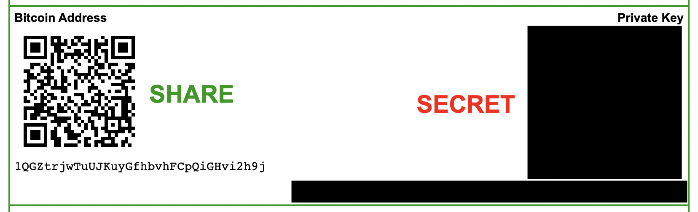
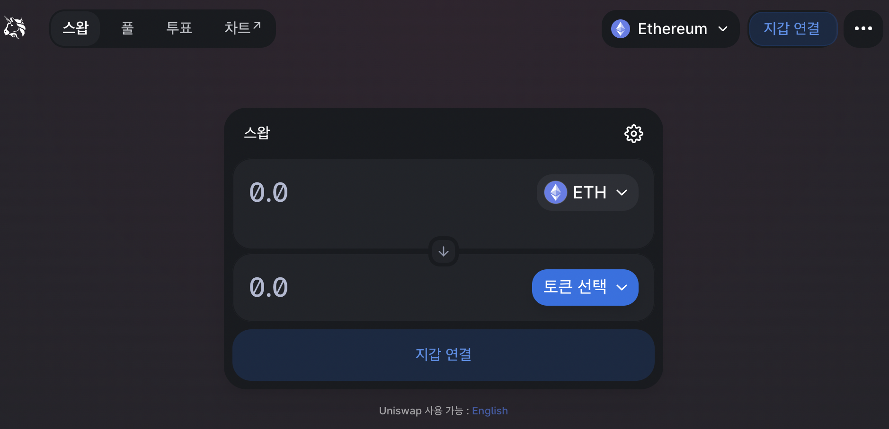
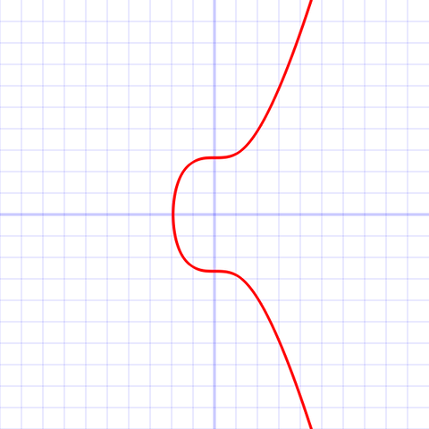
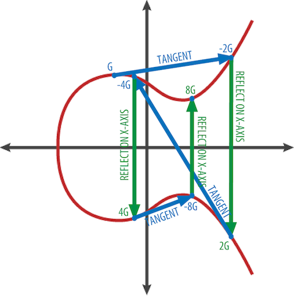

# 종이지갑 생성해보기

- [bitaddress.org](https://www.bitaddress.org/)

'bitaddress.org' 사이트에 접속해 종이지갑을 생성해보자. 사이트 접속 후 마우스 커서를 움직이면 화면에 초록색 점이 찍힌다. 점을 많이 찍을수록 진행률이 올라가는데 100%가 될 때까지 움직여주자. 모바일로 접속했다면 화면 가운데 있는 텍스트 박스에 글자를 무작위로 타이핑하면 된다. 지갑을 생성하는데 이러한 과정이 있는 이유는 진짜 랜덤한 값을 만들기 위함인데 이를 **암호학적으로 안전한 난수**라 부른다. 암호학적으로 안전한 난수 생성기는 통계적 무작위성 테스트를 통과해야 하고 생성한 난수열 중 일부가 노출되더라도 전체를 예측하기 힘들어야 한다. 그러나, 컴퓨터의 본질은 미리 정해진 대로 연산하는 기계이기 때문에 그 자체만으로 무작위성을 만들어내기에는 한계가 있다. 따라서, 'bitaddress.org' 경우에는 자신을 포함해 그 누구도 다시 재현할 수 없는 우리들의 행동을 기반으로 정말 랜덤한 값을 만드는 것이다.

진행률이 100%가 될 때까지 초록색 점을 찍으면 QR 코드 두 개가 나타난다. 여기서 'Bitcoin Address'(비트코인 주소)는 레거시 금융에서의 계좌번호와 비슷한 역할을 하고 'Private Key'(개인키)는 계좌 비밀번호와 같은 역할을 한다. 계좌번호 역할을 하는 비트코인 주소는 돈을 받기 위해 다른 사람에게 공개될 수 있다. 하지만, 계좌 비밀번호 역할을 하는 개인키는 외부에 절대로 노출하면 안 된다. 생성된 지갑은 'print' 버튼을 눌러 종이로 인쇄해 나만 아는 장소에 보관하도록 하자. 방금 여러분은 비트코인에서 사용할 수 있는 계좌 개설을 완료했다.


*bitaddress.org에서 생성한 종이지갑*

# 비트코인 혁신 포인트 1 - 신뢰 비용의 절감

종이지갑을 생성해보니 어떤 생각이 드는가? 마우스 몇 번 움직이는 노력만으로 비트코인 계좌를 개설할 수 있다니 굉장히 간편하지 않은가? 레거시 금융과 비교하면 이 간편함은 더욱 크게 다가온다. 은행 계좌를 개설하기 위해 우리는 신분증 사본을 제출하고 어떤 목적으로 개설하는지 증빙할 수 있는 자료도 제출해야 한다. 은행 계좌뿐만 아닌 신용카드 발급이나 간편결제 서비스를 이용하기 위해서도 해당 기관에 내가 나임을 증명할 수 있는 각종 자료를 제출해야 한다. 하지만, 비트코인은 그렇지 않다. 비트코인은 내가 나임을 증명하지 않고도 나의 자산을 보관하거나 사용할 수 있다. 이러한 개념이 발전하여 Web3라 불리는 DAPP(탈중앙화 애플리케이션, Decentralized Application)에서는 사용자의 개인정보 없이 개인키를 이용한 승인만으로 로그인한다. 즉, 비트코인은 레거시 금융에서 자산을 맡긴 사람과 자산을 보관하는 사람 사이에 발생하던 신뢰 비용을 없애버린 셈이다.


*[탈중앙화 거래소 유니스왑](https://app.uniswap.org/) - 지갑 연결(개인키 승인)으로 로그인한다.*

# 개인키

비트코인 지갑을 이루는 요소 중 먼저 개인키에 대해 알아보자. 비트코인 지갑을 만드는 일은 개인키를 생성하는 것부터 시작이다. 개인키는 무작위로 생성한 256bit 길이의 숫자로 구성된다. 1bit는 0 혹은 1을 표현하는 것이기 때문에 사실상 개인키 생성은 동전(앞면: 0, 뒷면: 1)을 256번 던지며 그 결과를 기록하는 것과 다름없다. 단, 타원곡선의 위수(order)인 $1.158 * 2^{77}$ 보다 작아야 하는데 이 값은 $2^{256}$ 보다 약간 작은 값이다. 타원곡선에 대해서는 뒤에서 자세히 살펴보자. 또 하나 중요한 것은 앞서 종이지갑에서 설명한 것과 같이 **암호학적으로 안전한 유사난수생성기(CSPRNG)** 를 사용해야한다. 보통 프로그램을 이용해 난수를 생성할 때 운영체제에서 제공하는 난수생성기를 이용하게 되는데 이 경우 해당 운영체제에서 제공하는 난수생성기가 암호학적으로 안전한지 확인할 필요가 있다.

## 우주에서 티끌 찾기

개인키를 생성하는 과정이 동전을 256번 던지는 행위와 유사하다면 직관적으로 '내가 생성한 개인키가 전세계 누군가와 겹치지 않을까?'라는 의문이 들 수 있다. 동전 던지기를 256번 하여 나올 수 있는 경우의 수는 $2^{256}$ 이다. 이를 10진법으로 표현하면 약 $10^{77}$ 정도 되는데 가시적인 우주를 구성하는 원자의 갯수가 $10^{80}$ 이라 하니 개인키 생성은 우주에서 티끌 찾는 수준의 확률이라고 볼 수 있다. 즉, 개인키가 겹치는 것은 현실적으로 불가능하기 때문에 이와 관련된 걱정은 하지 않아도 괜찮다.

# 타원곡선 암호학

비트코인은 공개키 암호 방식에 타원곡선 암호학을 사용한다. 타원곡선 중에서도 미국립표준기술원(NIST)에서 개발한 `secp256k1` 표준을 사용한다. 일반적인 타원곡선 수식은 $y^{2} = (x^{3} + ax + b) over (F_{p})$ 로 정의되는데 secp256k1 표준에서는 상수 $a$ 값은 0, 상수 $b$ 값은 7, 상수 $p$ 값은 $2^{256}-2^{32}-2^{9}-2^{8}-2^{7}-2^{6}-2^{4}-1$ 로 정의한다. 특히 $p$ 는 매우 큰 소수다. secp256k1 표준에서 사용하는 타원곡선의 수식과 그래프는 다음과 같다.


$$
y^{2} = (x^{3} + 7) over (F_{p})
$$

# 공개키

비트코인 공개키는 무작위로 생성한 숫자인 개인키($k$)와 타원곡선 위에 미리 정해진 값인 생성 포인트($G$)를 곱하여 얻게 되는 좌표($K$)다. 생성 포인트인 $G$의 좌표는 secp256k1 표준의 일부로 명시되어 있다. 즉 공개키는 다음의 수식으로 얻을 수 있다.

$$
K = k * G
$$

## 타원곡선 덧셈

타원곡선에서의 덧셈을 기하학적으로 설명하면 다음의 그림과 같다. 생성 포인트($G$)에서 접선을 그린 뒤 타원곡선과의 교차점을 찾고 x축 대칭을 하게 되면 $2G$ 를 얻게 된다. $2G$ 에서 접선을 그린 뒤 타원곡선과의 교차점을 찾고 $x$ 축 대칭을 하게 되면 $4G$ 를 얻게 된다. 즉, 공개키 생성은 이 과정을 $kG$ 좌표를 얻을 때 까지 반복하는 것이다. 타원곡선 수학에서 덧셈 연산자가 흥미로운 점은 개인키 $k$ 에서 공개키 $K$ 쪽으로 한 방향으로만 계산할 수 있다는 점이다. 즉, 공개키 $K$ 로부터 개인키 $k$ 를 도출할 수 없다. 이 점 때문에 공개키 $K$ 로부터 계산되는 비트코인 주소는 외부에 공개되어도 개인키 $k$ 는 안전한 것이다.


*기하학적인 방법을 이용한 타원곡선의 덧셈*

## 압축 공개키

공개키는 타원곡선 위에 있는 $(x, y)$ 좌표다. 그리고 우리는 타원곡선의 함수식을 알고 있다. 따라서, $(x, y)$ 좌표 중 $x$ 값과 $y$ 값의 부호만 알면 타원곡선 함수식인 $y^{2} = (x^{3} + 7) over (F_{p})$ 를 이용해 공개키의 $y$ 좌표를 계산할 수 있다. 타원곡선 함수식의 좌변이 $y^2$ 이므로 $y$ 값이 제곱근으로 표현되기 때문에 $x$ 값 뿐만 아니라 $y$ 값의 부호도 필요하다. 이 사실을 이용해 공개키를 표현할 때 $(x, y)$ 좌표 전체를 사용하는 것이 아닌 $x$ 값과 $y$ 값의 부호를 사용해 공개키를 표현할 수 있는데 이를 압축 공개키라고 부른다.

소수위수 $p$ 의 유한 체제상에서 2진법 연산의 타원곡선을 계산하는 경우 $y$ 좌표는 짝수이거나 홀수다. $y$ 값이 짝수 혹은 홀수라는 것은 앞서 설명한 양수 혹은 음수에 대응된다. 압축 공개키는 $y$ 값이 짝수일 경우에 '0x02'를 홀수일 경우에 '0x03'을 $x$ 값 앞에 붙여 표현한다.

### 압축 개인키

압축 공개키를 사용하고 싶을 때 개인키에 압축 공개키를 사용할 것이라는 표식을 남겨야 한다. 개인키에 표식이 있어야 지갑이 개인키를 보고 주소를 공개키로부터 생성할 것인지 압축 공개키로부터 생성할 것인지 판단할 수 있다. 바로 이후에 다루겠지만 비트코인 주소는 공개키 데이터로부터 생성되는데 $(x, y)$ 좌표를 사용하는 공개키와 $x$ 값과 $y$ 값의 부호를 사용하는 압축 공개키는 데이터가 다르기 때문에 주소도 다르게 생성된다. 공개키를 압축 공개키 형식으로 표현해야 하는 개인키를 압축 개인키라고 부르며 개인키 데이터 끝에 '0x01' 값을 추가한다.

> 압축 개인키라고 하여 개인키가 압축되는 것이 아님에 유의하자. 오히려 데이터 길이는 1바이트 늘어난다.

# 비트코인 주소

비트코인 주소는 비트코인 네트워크에서 은행 계좌와 같이 사용되는 문자열이다. 일반적으로 송금 형태의 거래인 `P2PKH`(pay-to-public-key-hash) 거래 방식에서는 주소가 '1'로 시작한다. 스크립트로 거래가 이뤄지는 `P2SH`(pay-to-script-hash) 거래 방식에서는 주소가 '3'으로 시작한다. 최근에는 QR코드와 음성 대화에서 더 잘 사용할 수 있도록 `Bech32` 인코딩 형식을 사용한 'bc1'으로 시작하는 주소 형식도 있다. 이 글에서는 전통적인 송금 방식에 사용되는 P2PKH 주소를 생성하는 방법에 대해 다루도록 하겠다. '1'로 시작하는 P2PKH 주소를 레거시(Legacy) 형식이라고 말하기도 한다.

## 공개키 해싱

비트코인 주소는 'SHA(Secure Hash Algorithm)'와 'RIPEMD(RACE Integrity Primitives Evaluation Message Digest)'를 이용한 두 번의 해싱을 통해 얻을 수 있다. 공개키 $K$ 를 `SHA256` 으로 해싱한 뒤 그 결괏값을 `RIPEMD160` 으로 한 번 더 해싱하여 얻어지는 20바이트 크기의 숫자가 비트코인의 주소다. 공개키로부터 비트코인 주소를 산출하는 과정을 수식으로 표현하면 다음과 같다.

$$
Address = RIPEMD160(SHA256(K))
$$

## Base58Check 인코딩

공개키를 두 번 해싱하여 얻은 값이 비트코인 주소이긴 하나 이것을 그대로 사용하지 않고 `Base58Check` 인코딩을 거친다. `Base58`은 58개의 문자를 이용해 사람이 읽을 수 있도록 변화하는 인코딩 포맷이다. 널리 사용되는 `Base64`에서 비슷한 모양의 문자 6개(0, O, l, I, +, /)를 제거하여 58개의 문자로 인코딩하는 방식이다. 여기에 오타나 데이터 입력 오류 등에 대비하여 인코딩 결과를 검사할 수 있는 오류 검사 코드(checksum)를 포함한 것이 Base58Check 인코딩이다. Base58Check 인코딩은 비트코인에서 주소뿐만 아니라 개인키, 암호화키, 스크립트 해시 등 다양한 곳에서 사용된다.

# 코드로 살펴보기

지금까지 설명한 절차 그대로를 코드로 옮기면 개인키와 비트코인 주소를 어렵지 않게 생성할 수 있다. 개인적으로 최근에 `Go` 언어를 관심 있게 살펴보며 익히고 있어 Go를 사용해 개인키부터 비트코인 주소까지 생성하는 코드를 작성해보았다. 전체 코드는 아래 링크에서 확인할 수 있다.

- [bitcoin-key-to-address.go](https://gist.github.com/sogoagain/5f77ac6d6c023551aeb4b80f6b9909d3#file-bitcoin-key-to-address-go)

## 개인키
### 개인키 생성

```Go
func generateRandom32Bytes() []byte {
	bytes := make([]byte, 32)
	rand.Read(bytes)
	return bytes
}

func main() {
	privateKey := generateRandom32Bytes()
    // ...
}
```

보다시피 개인키는 32bytes 크기의 랜덤한 숫자다. 1byte = 8bit 이므로 32bytes는 256bit다. 즉, 개인키는 256개의 1과 0으로 이루어진다. Go 언어의 `crypto/rand` 모듈은 OS에서 제공하는 암호학적으로 안전한 난수 생성기를 사용한다.

### 압축 개인키로 변환

```Go
func getCompressedPrivateKey(privateKey []byte) []byte {
	decoded, _ := hex.DecodeString(fmt.Sprintf("%x01", privateKey))
	return decoded
}

func main() {
	// ...
	compressedPrivateKey := getCompressedPrivateKey(privateKey)
    // ...
}
```

압축 공개키의 생성 출처가 되는 압축 개인키는 앞서 생성한 개인키의 16진수 표현 끝에 '0x01'를 덧붙인다.

### 개인키 출력

```Go
func encodePrivateKey(privateKey []byte) string {
	return base58.CheckEncode(privateKey, 128)
}


func main() {
    // ...
	fmt.Printf("Private Key (hex): %x\n", privateKey)
	fmt.Printf("Private Key (decimal): %d\n", new(big.Int).SetBytes(privateKey))
	fmt.Printf("Private Key (WIF): %s\n", encodePrivateKey(privateKey))
	fmt.Printf("Compressed Private Key (hex): %x\n", compressedPrivateKey)
	fmt.Printf("Compressed Private Key (WIF): %s\n", encodePrivateKey(compressedPrivateKey))
    // ...
}
```

하나의 개인키를 다양한 포맷으로 표현할 수 있다. 위 예시에서 `hex`는 16진법으로 `decimal`은 10진법으로 개인키를 출력한다. `WIF` 포맷은 개인키를 Base58Check 방식으로 인코딩한 형태를 일컫는다. 개인키를 Base58Check로 인코딩할 때에는 버전 접두부(version prefix) 값으로 '0x80'(128)을 사용한다.
## 공개키
### 공개키 좌표 계산

```Go
func main() {
    // ...
	s256 := secp256k1.S256()
	x, y := s256.ScalarBaseMult(privateKey)

	fmt.Printf("Public Key (x, y) coordinates: (%s, %s)\n", x, y)
    // ...
}
```

공개키는 secp256k1 타원곡선에 정의된 생성포인트($G$)에 개인키를 곱하여 얻은 타원곡선 위 좌표다. 아쉽게도 Go언어에서 제공하는 타원곡선 모듈인 `crypto/elliptic`에서는 secp256k1 표준을 제공하지 않는다. 따라서 위 예시에서는 `go-ethereum`에서 제공하는 `crypto/secp256k1` 모듈을 사용하였다.

### 비압축 공개키

```Go
func getPublicKey(x *big.Int, y *big.Int) string {
	return fmt.Sprintf("04%064x%064x", x, y)
}

func main() {
    // ...
	publicKey := getPublicKey(x, y)
    // ...

	fmt.Printf("Public Key (hex): %s\n", publicKey)
    // ...
}
```

공개키의 $(x, y)$ 좌표 모두를 사용하는 비압축 공개키는 16진법으로 나타내며 '0x04'를 시작으로 그 뒤에 $x$ 와 $y$ 의 16진법 표현을 이어 붙인다.

### 압축 공개키

```Go
func getCompressedPublicKey(x *big.Int, y *big.Int) string {
	z := new(big.Int)
	z.Mod(y, big.NewInt(2))
	if z.Cmp(big.NewInt(1)) == 0 {
		return fmt.Sprintf("03%064x", x)
	} else {
		return fmt.Sprintf("02%064x", x)
	}
}

func main() {
    // ...
	compressedPublicKey := getCompressedPublicKey(x, y)
    // ...
	fmt.Printf("Compressed Public Key (hex): %s\n", compressedPublicKey)
}
```

압축 공개키는 16진법으로 나타내며 $y$ 가 짝수일 때는 '0x02'를 시작으로 홀수일 때는 '0x03'을 시작으로 그 뒤에 $x$ 의 16진법 표현을 이어 붙인다.

## 비트코인 주소
### 공개키를 비트코인 주소로 변환

```Go
func publicKeyToAddress(publicKey string) string {
	decoded, _ := hex.DecodeString(publicKey)

	sha := sha256.New()
	sha.Write(decoded)
	intermed := sha.Sum(nil)

	ripemd := ripemd160.New()
	ripemd.Write(intermed)
	digest := ripemd.Sum(nil)

	return base58.CheckEncode(digest, 0)
}

func main() {
    // ...
	fmt.Printf("Bitcoin Address: %s\n", publicKeyToAddress(publicKey))
	fmt.Printf("Compressed Bitcoin Address: %s\n", publicKeyToAddress(compressedPublicKey))
}
```

앞서 생성한 공개키를 SHA256으로 먼저 해싱하고 그 결괏값을 다시 한번 더 RIPEMD160으로 해싱한다. 마지막으로 Base58Check 인코딩을 거치면 비트코인 주소를 얻을 수 있다. 비트코인 주소를 Base58Check로 인코딩할 때에는 버전 접두부(version prefix) 값으로 '0x00'(0)을 사용한다.

## 키와 주소 생성은 네트워크 연결이 필요없다.

예시 코드를 살펴보면 키와 주소를 생성할 때 그 어떤 네트워크에도 접속하지 않음을 알 수 있다. 즉, 독립적으로 정해진 알고리즘만 따른다면 키와 주소를 생성할 수 있다. 특히, 개인키는 절대로 외부에 노출되면 안 되기 때문에 개인키를 생성할 때 보안을 위해 네트워크가 차단된 환경에서 생성하도록 하자.

# 참고문헌

- 안드레아스 M 안토노풀로스. 비트코인, 공개 블록체인 프로그래밍(2판). 고려대학교출판문화원, 2018.
- [유사난수](https://ko.wikipedia.org/wiki/%EC%9C%A0%EC%82%AC%EB%82%9C%EC%88%98)
- [Secp256k1](https://en.bitcoin.it/wiki/Secp256k1)
- [Bech32](http://wiki.hash.kr/index.php/Bech32)
