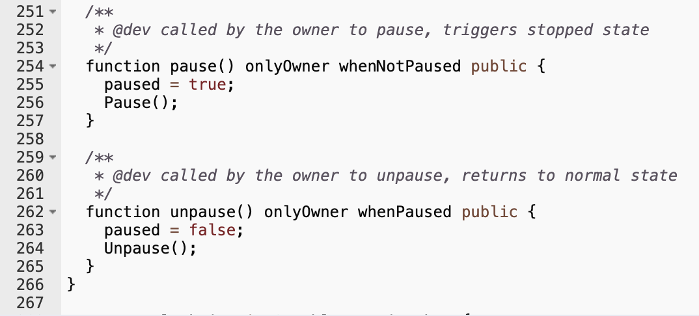

8월 초 시작한 솔리디티 스터디가 어제로 마무리되었다. 3개월이란 긴 시간 동안 새로운 개발 환경을 다루는 것은 흥미로운 경험이었다. 이더리움 그리고 그 위에서 동작하는 앱과 토큰들의 정체가 알고 싶어 참여했다. 알게 된 내용을 간단히 정리해 보고자 한다.

스터디를 통해 솔리디티 문법, 솔리디티로 스마트 컨트랙트 작성 시 자주 사용되는 패턴들, EVM(이더리움 가상머신)의 구조와 원리, ERC20 및 ERC721(NFT) 토큰 발행에 관해 공부하였다.

이더리움의 토큰들은 중앙화된 자산이다. 어쩌면 당연한 이야기겠지만 코드로 직접 확인하니 더욱 와닿았다. 'owner', 'role', 'admin'... 솔리디티로 작성된 코드들에서 가장 많이 본 키워드들이다. 이는 토큰을 제어할 수 있는 사람이 있다는 것이며 중앙화되어 있다는 것을 뜻한다.

이더리움 생태계에 투자하는 사람이라면 자신이 구매하는 토큰의 소스코드를 반드시 읽어보길 바란다. 'owner'의 권한이 어느 정도인지 확인할 필요가 있다. 소스코드가 공개되어 있지 않다면 투자를 피하자. 극단적으로 클릭 한 번으로 'owner'가 모든 토큰을 자신의 지갑으로 옮기게 만들수도 있다.

다음은 많이들 소유한 테더(USDT) 토큰의 소스코드다. 'owner'의 마우스 클릭 한 번으로 토큰들의 입출금을 막아버릴 수 있다. 'owner'가 자금을 동결시킬 수 있는 것이다. 이러한 자산을 소유하고 싶은가?

*테더(USDT) 토큰 소스코드*

이더리움의 개발 환경은 중앙화된 서비스에 많이 기대고 있다. 작성한 컨트랙트를 배포하기 위해 infura, alchemy와 같은 중앙화된 Provider 서비스를 이용해야 한다.

이더리움은 플랫폼 인프라라고 생각한다. 기존에는 서비스 제공자가 서버 비용을 부담했다면 이더리움 위에서는 소비자가 서버 비용을 분담하는 형태다. 클라우드 서비스가 분산화된 것과 비슷한 느낌을 준다. 생각보다 꽤 다양한 유형의 앱을 작성하여 이더리움 네트워크 위에 올릴 수 있다.

이더리움 위에 올라간 컨트랙트를 실행하기 위해서는 가스라고 하는 비용이 발생한다. 가스비는 컨트랙트 연산량에 비례한다. 따라서, 코드를 작성할 때 가스비를 줄이기 위해 갖은 방법을 사용한다. 과거 HW 자원이 비쌌던 시절이 떠오른다. 문자열 비교부터 일반적인 프로그래밍과 다르다.

이더리움은 기업이 좋아할 만한 점들을 갖고 있다. 중앙화된 자산을 네트워크에 공개하여 쉽게 거래할 수 있도록 할 수 있고 개발자 공급이 원활하기 때문에 수요는 계속 있을 것 같다. 현실적인 개발자라면 한 번쯤 공부해 보는 것도 나쁘지 않을 듯싶다.

개발자 입장에서 새로운 기술을 배우는 것이기에 즐거움은 있었지만 아쉽게도 비트코인을 공부하며 느낀 전율을 이더리움에서는 느낄 수 없었다. 오히려 비트코인의 탈중앙화라는 가치가 얼마나 얻기 어려운 것이며 소중한 것인지 다시금 생각해 보는 계기가 되었다.

연말까지 컨트랙트를 개발해 블로그에 가볍게 적용해 봐야겠다. 이후엔 비트코인의 라이트닝 네트워크를 공부해 보며 이더리움으로 구현한 기능을 비트코인 라이트닝 네트워크로 동일하게 구현하여 둘 간의 차이점을 살펴볼 예정이다.
