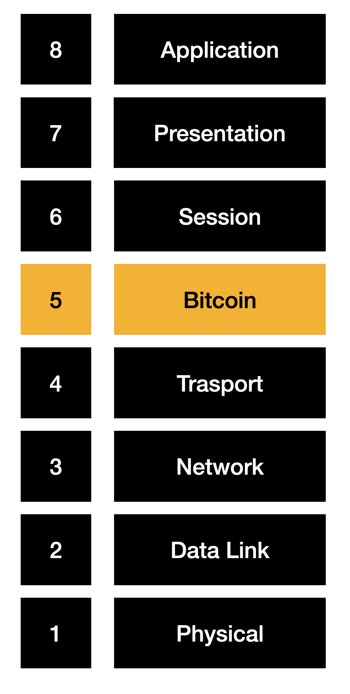
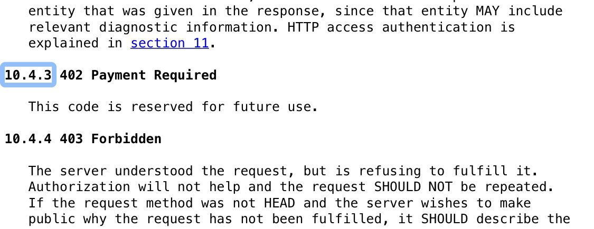

최근에 비트코인이 사이버 보안의 혁신이 될 수 있다는 내용의 영상을 보았다. 이 영상을 보면서 미래에는 비트코인이 인터넷 프로토콜로서 동작할 수도 있겠다고 생각하게 되었다.

[제이슨 로뤼: POW는 사이버 보안의 완전히 새로운 혁신이다.](https://www.youtube.com/watch?v=2dxVFmJTtg8)

비트코인을 사이버 보안 측면에 이용한다는 것은 인터넷 요청마다 사토시를 지출하는 것을 말한다. 현재 사이버 세상은 현실과 달리 물리적인 힘이 필요 없다. 그렇기 때문에 현실에선 한 상점을 털려면 매우 많은 에너지가 필요하지만, 사이버 세상에선 상대적으로 아주 적은 비용만 필요할 뿐이다.

비트코인은 물리적 에너지를 저장하는 가치물이다. 그렇기 때문에 인터넷 요청에 사토시를 지불한다는 것은 저장한 에너지를 사용하는 것이다. 이는 곧 사이버 세상에 물리적 힘을 투사하게 되는 것을 말한다. 즉 사이버 세상의 상점을 털기 위해서도 현실처럼 많은 에너지가 필요하게 된다는 뜻이다.

인터넷 요청에 비용이 발생하면 공격에 한계가 생긴다. 최근 '아바타'를 아이맥스에서 관람하고자 예매를 시도했는데 매크로 프로그램들을 이길 수 없었다. 현재는 사이버 세상에 물리적 힘이 존재하지 않기 때문에 예매조차 불공정한 것이다. 그러나 매번 사토시를 지출하게 된다면 이야기가 달라진다.

앞서 이야기한 개념은 플랫폼에 비용을 지불하고 이용하는 것과는 차원이 다른 이야기다. 플랫폼에 비용을 지불하는 행위는 공격자의 공격 행위를 막는 데 큰 도움이 되지 않는다. 여전히 공격자는 적은 비용으로 서비스를 제공하는 서버에 위해를 가할 수 있기 때문이다.

또한, 인터넷 요청에 사토시를 지출하는 행위는 소비자와 공급자 모두가 의식하지 않은 선에서 이루어져야 한다. 우리가 현실 세상에서 매 순간 행동할 때 에너지를 얼마나 소모하는지 따지지 않는 것과 비슷한 이치다.

그렇기 때문에 나는 비트코인이 사이버 보안에 이용되기 위해선 비트코인이 인터넷을 이루는 프로토콜에 편입되어야 한다고 생각한다. 예컨대 HTTP 프로토콜에 편입될 수도 있고 TCP/IP와 같은 수준의 새로운 전송 계층이 생길 수도 있다. 혹은 네트워크의 OSI 7계층이 OSI 8계층이 될 수도 있다.

*네트워크 OSI 계층에 비트코인이 포함된 예시*

비트코인이 인터넷 프로토콜로서 동작하게 되는 것이다. 이렇게 된다면 소비자는 공유기, 통신사, 브라우저 등 어딘가에 비트코인을 충전한 뒤 인터넷을 사용하게 된다. 공급자 역시 사토시 지출을 검증하는 장치, 도구가 제공될 것이고 이를 이용하기만 하면 큰 무리 없이 서비스를 제공할 수 있다.

어디까지나 나의 상상이긴 하지만 라이트닝 네트워크, nostr 등 다양한 도구들이 등장하는 것을 보면 언젠가 현실이 될 것이라 생각한다. 서로 다른 도구들 사이의 호환을 위해선 프로토콜이 필요할 것이고 그 기반은 모두가 사용하고 있는 인터넷이 될 확률이 높지 않을까?

이미 웹은 비트코인을 기다리고 있었다.

>웹은 비트코인을 기다리고 있었나?  HTTP 응답 코드 중 402 코드는 ‘Payment Required’를 뜻한다. 하지만 실제 사용되고 있지 않으며 현재까지 미래를 위해 예약된 코드로 남아있다.  1997년부터 기다리던 진정한 인터넷 결제 수단이 나타났다. 이제는 예약된 코드에서 탈출해야 하지 않을까?

*HTTP 응답 코드 중 402 Payment Required*
