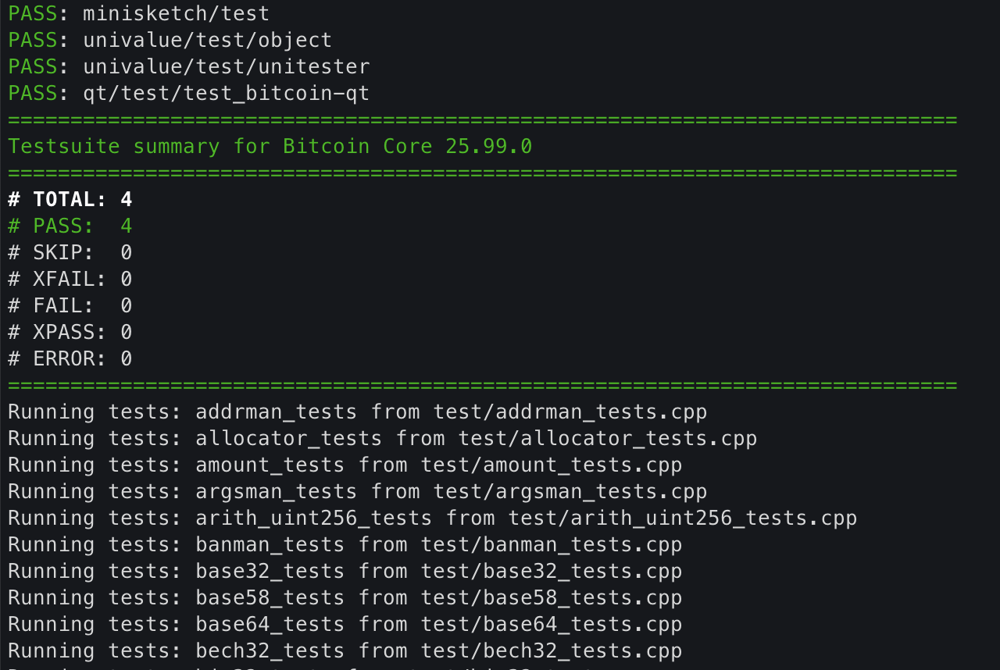

# 배경

최근 비트코인 개발자 후원과 관련된 일련의 논쟁을 보며 정리된 생각이 있다. 비트코인은 최대한 작은 코드로 유지되어야 하며 누구든 공부를 통해 이해할 수 있는 수준으로 개발되어야 한다는 것이다. 만약, 비트코인의 코드가 커지고 복잡해진다면 비트코인 개발은 소수의 개발자 손에 좌지우지될 것이고, 이처럼 개발 활동이 중앙화되면 비트코인을 지키기가 어려워질 것이기 때문이다. 비트코인이 지속되려면 자신의 자산을 지키기 위한 동기만으로도 충분히 비트코인을 개발할 수 있어야 한다고 생각한다.

이와 관련해 짤막한 글을 작성했는데, 이미 복잡해졌다거나 비현실적인 이상이라든가 하는 의견들을 마주하게 되었다. 이러한 의견들에 대해 말 보다는 행동으로 증명하고 싶어 Bitcoin Core 코드를 정복해 보겠다고 다짐하였다. 현시점에서도 나의 자산을 지키기 위한 동기만으로도 충분히 Bitcoin Core를 개발할 수 있다는 것을 보이고자 한다. 그 첫 단계로 로컬에 Bitcoin Core 개발환경을 구성하는 과정을 기록해 보았다.

# 시작하기 전에

본 글은 mac OS 환경을 기준으로 작성되었다. 다른 OS를 사용하고 있다면 Bitcoin Core의 `doc/build-*.md` 문서를 참고하길 바란다.

- [macOS](https://github.com/bitcoin/bitcoin/blob/master/doc/build-osx.md)
- [Unix](https://github.com/bitcoin/bitcoin/blob/master/doc/build-unix.md)
- [Windows](https://github.com/bitcoin/bitcoin/blob/master/doc/build-windows.md)
- [FreeBSD](https://github.com/bitcoin/bitcoin/blob/master/doc/build-freebsd.md)
- [OpenBSD](https://github.com/bitcoin/bitcoin/blob/master/doc/build-openbsd.md)
- [NetBSD](https://github.com/bitcoin/bitcoin/blob/master/doc/build-netbsd.md)
- [Android](https://github.com/bitcoin/bitcoin/blob/master/doc/build-android.md)

또한, 이 글은 작성 시점에 Bitcoin Core의 최신 버전인 24.0.1 버전을 기준으로 작성하였다.

# 준비

## 1. Xcode 명령줄 도구 설치

다음 명령어를 입력해 Xcode 명령줄 도구를 설치한다.

```sh
xcode-select --install
```

## 2. 패키지 관리자 Homebrew 설치

다음 명령어를 입력해 macOS에서 주로 사용되는 패키지 관리자인 `Homebrew`를 설치한다.

```sh
/bin/bash -c "$(curl -fsSL https://raw.githubusercontent.com/Homebrew/install/HEAD/install.sh)"
```

## 3. 필수 의존성 설치

다음 명령어를 입력해 Bitcoin Core에서 사용하는 필수 의존성을 설치한다.

```sh
brew install automake libtool boost pkg-config libevent
```

필수로 설치해야 하는 의존성들에 대해 간단히 설명하면 다음과 같다.

- [`Automake`](https://www.gnu.org/software/automake/): 포팅할 수 있는 `makefile`들을 만들어 내는 도구로 소프트웨어를 컴파일하는데 사용한다.
- [`Libtool`](https://www.gnu.org/software/libtool/): 포터블 라이브러리를 만드는 데 이용하는 도구로 일반적으로 `Automake`와 함께 사용한다.
- [`Boost`](https://www.boost.org/): C++ 프로그래밍 언어를 위한 선형대수, 의사 난수 발생, 멀티스레딩, 유닛 테스트와 같은 작업들과 구조들을 지원하는 라이브러리 집합이다.
- [`pkg-config`](https://www.freedesktop.org/wiki/Software/pkg-config/): 소스 코드로부터 소프트웨어를 컴파일할 목적으로 설치된 라이브러리를 조회하기 위해 통일된 인터페이스를 제공하는 소프트웨어다.
- [`Libevent`](https://libevent.org/): 파일 지시자(file descriptor)에서 특정 이벤트가 발생했을 때, 일정 시간이 지났을 때, signal이 발생했을 때 미리 등록한 콜백(callback) 함수를 실행하는 메커니즘을 제공하는 라이브러리다.

## 4. Bitcoin Core 저장소 클론

다음 명령어를 입력해 Bitcoin Core의 Git 저장소를 클론한다.

```sh
git clone https://github.com/bitcoin/bitcoin.git
```

## 5. 의존성 설치 (선택)

지금부터 설명하는 의존성은 선택사항이다. 이 의존성들은 설치하지 않더라도 `bitcoind`를 구동하는 데 문제가 되지 않는다. 따라서 필요한 기능이 아니라면 설치를 건너뛰어도 좋다.

### 지갑(Wallet) 의존성

#### Descriptor 지갑 지원

Descriptor 지갑을 지원하기 위해 `sqlite`가 필요한데 macOS에는 `sqlite` 패키지가 기본으로 포함되어 있다. 그러므로 별도의 설치는 필요 없다.

#### Legacy 지갑 지원

레거시 지갑을 지원하기 위해서는 `berkeley-db@4` 패키지가 필요하다. 다음 명령어로 설치할 수 있다.

```sh
brew install berkeley-db@4
```

### GUI 의존성

#### Qt

Bitcoin Core는 크로스 플랫폼 GUI 프레임워크인 `Qt`를 이용해 GUI를 제공한다. GUI 지원이 필요하다면 다음 명령어로 `qt@5`를 설치한다.

```sh
brew install qt@5
```

#### qrencode

GUI에서는 주소를 QR 코드로 출력할 수 있다. 이 기능을 지원하기 위해 `qrencode` 패키지가 필요하다. 다음 명령어로 설치할 수 있다.

```sh
brew install qrencode
```

### 포트 매핑 의존성

`UPnP` 포트 매핑과 `NAT-PMP` 포트 매핑은 기본적으로 비활성화 되어있다. 기능 활성화를 위해선 별도의 설정이 필요하다.

#### miniupnpc

다음의 명령어로 `UPnP` 포트 매핑에 사용되는 `miniupnpc` 패키지를 설치할 수 있다.

```sh
brew install miniupnpc
```

#### libnatpmp

다음의 명령어로 `NAT-PMP` 포트 매핑에 사용되는 `libnatpmp` 패키지를 설치할 수 있다.

```sh
brew install libnatpmp
```

### ZMQ(ZeroMQ) 의존성

ZMQ(ZeroMQ)는 분산/동시성 애플리케이션에서 사용하도록 개발된 고성능 비동기 메시징 라이브러리다. ZMQ notification을 지원하려면 다음의 명령어로 `zeromq` 패키지를 설치한다.

```sh
brew install zeromq
```

### 자동화 테스트 의존성

자동화 테스트를 실행하려면 Python 3가 필요하다. 다음의 명령어로 설치할 수 있다.

```sh
brew install python
```

### 배포 의존성

`make deploy` 명령어를 사용해 Bitcoin Core 애플리케이션을 `.dmg`로 배포할 수 있다. 이를 위한 `python` 패키지들을 다음의 명령어로 설치할 수 있다.

```sh
pip3 install ds_store mac_alias
```

# Bitcoin Core 빌드하기

## 1. 구성

Bitcoin Core를 구성하는 방법은 다양하다. 아래의 명령어를 통해 구성을 위한 옵션들을 확인할 수 있다.

```sh
./configure -help
```

본 글에서는 다음과 같이 별도의 옵션을 할당하지 않고 구성을 진행했다.

```sh
./autogen.sh
./configure
```

## 2. 컴파일

구성이 완료되었다면 아래의 명령어를 이용해 Bitcoin Core를 컴파일할 수 있다.

```sh
make
```

## 3. 자동화 테스트 실행

컴파일이 완료되었다면 다음 명령어를 이용해 자동화 테스트를 실행할 수 있다.

```sh
make check
```


*Bitcoin Core 자동화 테스트 실행 화면*

## 4. 배포

다음의 명령어를 이용해 `.dmg` 설치 파일을 생성할 수 있다.

```sh
make deploy
```

# Bitcoin Core 실행하기

## 실행파일
빌드가 완료되었다면 `./src/bitcoind`를 실행할 수 있다. GUI를 지원하도록 컴파일 했다면 `./src/qt/bitcoin-qt`도 실행할 수 있다.

`bitcoind` 혹은 `bitcoin-qt`를 처음 실행하면 블록체인을 다운로드하기 시작한다. 다운로드는 환경에 따라 몇 시간에서 며칠이 걸릴 수 있다.

## 환경설정

실행하기 전 아래의 명령어를 이용해 비어있는 설정 파일(`bitcoin.conf`)을 생성한다.

```sh
mkdir -p "/Users/${USER}/Library/Application Support/Bitcoin"
touch "/Users/${USER}/Library/Application Support/Bitcoin/bitcoin.conf"
chmod 600 "/Users/${USER}/Library/Application Support/Bitcoin/bitcoin.conf"
```

`bitcoin.conf` 파일에 Bitcoin Core 실행에 필요한 다양한 설정을 작성할 수 있다. 예를 들어 `datadir` 옵션을 이용해 데이터가 저장되는 경로를 지정할 수 있고 `txindex`를 `1`로 설정해 전체 트랜잭션의 인덱스를 유지하도록 설정할 수 있다.

```sh
datadir=path/directory
txindex=1
```

이 외에도 다양한 설정이 가능하다. 세부적인 설정은 [Bitcoin Core Config Generator](https://jlopp.github.io/bitcoin-core-config-generator/)와 같은 도구의 도움을 받아 보다 쉽게 구성할 수 있다.

참고로 별도의 설정을 하지 않고 실행한다면 아래 경로에 데이터가 저장된다.

```sh
/Users/${USER}/Library/Application Support/Bitcoin/
```

## 모니터링

아래 명령어를 통해 `debug.log` 파일에 기록되는 로그로 블록체인 다운로드 과정을 모니터링 할 수 있다.

```
tail -f $HOME/Library/Application\ Support/Bitcoin/debug.log
```

# 기타 명령어

- 비트코인 데몬 실행하기

```sh
./src/bitcoind -daemon
```

- 명령줄 옵션 목록 보기

```sh
./src/bitcoin-cli --help
```

- 데몬이 실행 중일 때 사용할 수 있는 RPC 명령 목록 보기

```sh
./src/bitcoin-cli help
```

- `bitcoin-cli`의 제어를 허용하기 위해 `bitcoin-qt`를 서버 모드로 실행하기

```sh
./src/qt/bitcoin-qt -server
```

# 마치며

이제 로컬 환경에서 Bitcoin Core의 코드를 수정하고 컴파일하고 테스트하고 빌드하고 실행할 수 있게 되었다. 즉, Bitcoin Core를 개발할 준비가 끝난 것이다. 이는 코드 정복을 위한 첫걸음으로 이후에는 구성한 개발 환경을 토대로 Bitcoin Core의 코드를 분석해 나갈 것이며 그 과정에서 알게 된 내용을 정리해 공유할 생각이다.

# 참고문헌

- [macOS Build Guide](https://github.com/bitcoin/bitcoin/blob/master/doc/build-osx.md)
- [Automake](https://ko.wikipedia.org/wiki/Automake)
- [Libtool](https://ko.wikipedia.org/wiki/Libtool)
- [Boost (C++ 라이브러리)](https://ko.wikipedia.org/wiki/Boost_(C%2B%2B_%EB%9D%BC%EC%9D%B4%EB%B8%8C%EB%9F%AC%EB%A6%AC))
- [pkg-config](https://ko.wikipedia.org/wiki/Pkg-config)
- [libevent 분석](https://www.minzkn.com/moniwiki/wiki.php/libevent#s-1.1)
- [ZeroMQ](https://ko.wikipedia.org/wiki/ZeroMQ)
