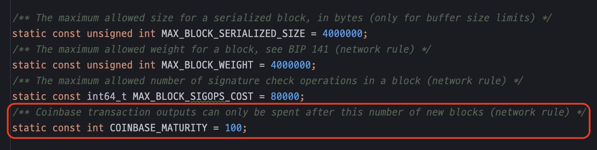

# 실행 가능한 요구사항 문서, 테스트 코드

테스트 코드는 프로그래밍 활동에서 굉장히 중요한 부분을 차지한다. 그 이유는 '테스트 코드'라는 단어의 의미를 생각해보면 알 수 있다. '테스트'는 프로그램이 요구사항대로 동작하는지 확인하는 행위고 '코드'는 프로그래밍 언어로 작성된 명령문이다. 즉, '테스트 코드'는 프로그램으로 구현해야 할 요구사항을 코드로 명료하게 기술한 문서다. '테스트 코드'가 요구사항 문서이기 때문에 이를 통해 해당 프로그램이 어떤 기능을 제공해야 하는지 파악할 수 있다. 뿐만 아니라 테스트 코드는 코드로 작성되었기 때문에 실행 가능한 문서다. 그래서 언제든지 테스트 코드를 실행해 구현한 프로그램이 요구사항을 만족하고 있는지 적은 비용으로 항시 검증할 수 있다. 실행 가능한 요구사항 문서가 중요하지 않게 취급될 일 없다.

Bitcoin Core 역시 다양한 테스트 코드를 작성하고 있어 Bitcoin Core가 제공하는 기능을 파악하는데 이러한 테스트 코드들을 활용할 수 있다. Bitcoin Core에는 퍼징(Fuzz testing), 기능 테스트(Functional testing), 유틸리티 테스트(Utility testing), 단위 테스트(Unit testing)와 같은 다양한 유형의 테스트 코드가 작성되어 있는데 이번 글에서는 기능 테스트에 대해 소개하고자 한다. 먼저 기능 테스트를 작성하는데 기반이 되는 구조를 살펴보고 간단한 예제를 통해 실제 사용 사례를 소개하고자 한다. 

# Bitcoin Core의 기능 테스트 (Functional testing)

일반적으로 기능 테스트는 블랙박스 테스트 기법의 일종이다. 즉, 기능 테스트는 해당 시스템이 '무엇'을 하는지에 대해 기술하며 내부 구조에 대해서는 드러내지 않는다. Bitcoin Core에서는 기능 테스트를 통해 `bitcoind`, `bitcoin-qt`와 RPC 및 P2P 인터페이스를 이용해 상호 작용하며 기능들을 테스트한다. 테스트 시 실제로 노드를 구동하여 기능을 검증하는 통합 테스트다.

기능 테스트는 `/test/functional` 경로에 `Python` 프로그래밍 언어로 작성한다.

# 기능 테스트 기반 구조 분석

## `BitcoinTestFramework` 클래스

`BitcoinTestFramework` 클래스는 테스트 프레임워크라는 이름에서 알 수 있듯이 기능 테스트 스크립트의 작성과 실행을 도와주는 클래스다. 기본적으로 각 기능 테스트 스크립트는 `BitcoinTestFramework` 클래스를 상속받아 구현하며 `BitcoinTestFramework`의 `set_test_params()`과 `run_test()` 메서드를 필수로 재정의 해야 한다.

### 필수로 재정의 해야하는 메서드

#### `set_test_params()`

- 노드의 수, 체인의 상태 등 기능 테스트의 기본 설정 파라미터들을 변경할 수 있다.
- 예를 들어 아래와 같이 `setup_clean_chain` 파라미터를 `True`로 설정하여 프리 마이닝된 체인 없이 제네시스 블록부터 체인을 구성하도록 할 수 있고 `num_nodes`의 값을 `2`로 설정해 구동할 노드의 숫자를 지정할 수 있다. 또한 각 노드들이 실행될 때 사용할 인수를 지정할 수 있다.
    - 참고로 `setup_clean_chain` 파라미터의 기본값은 `False`이며 테스트 시작 시 프리 마이닝된 200개 블록으로 블록체인을 구성한다.

```Python
    def set_test_params(self):
        self.setup_clean_chain = True
        self.num_nodes = 2
        self.extra_args = [
            ["-blockfilterindex=1"],
            [],
        ]
```

#### `run_test()`

- 검증할 테스트 로직을 작성한다.
- 아래는 `node0`에 지갑이 없다는 것을 검증하는 간단한 예시다.

```Python
    def run_test(self):
        assert_equal(self.nodes[0].listwallets(), [])
```

### 선택적으로 재정의 할 수 있는 메서드

필수로 재정의 해야 하는 두 가지 메서드 외에도 테스트 환경을 구성하기 위해 아래와 같은 메서드들을 선택적으로 재정의하여 사용할 수 있다.

#### `add_options()`

- 테스트를 위한 명령줄 옵션을 추가할 수 있다.
- 예를 들어 아래와 같이 테스트 구동 시 지갑 옵션을 추가할 수 있다.

```Python
    def add_options(self, parser):
        self.add_wallet_options(parser)
```

#### `setup_chain()`

- 노드들의 데이터 경로에 접근해 블록체인 설정을 변경해야 할 때 재정의한다. 보통 기본 설정으로도 충분하기 때문에 자주 사용되는 메서드는 아니다.
- 예를들어 아래 예시와 같이 `node0`의 `bitcoin.conf` 파일을 불러와 추가 설정을 작성할 수 있다.

```Python
    def setup_chain(self):
        super().setup_chain()
        with open(os.path.join(self.options.tmpdir, "node0", "bitcoin.conf"), "a", encoding='utf8') as f:
            f.write("uacomment=main\nincludeconf=relative.conf\n")
```

#### `setup_network()`

- 노드들의 네트워크 토폴로지를 설정할 수 있다.
- 재정의하지 않는다면 다음과 같이 노드들이 선형적으로 연결된 토폴로지로 구성된다. 대부분의 경우 이 구성으로도 충분하다.
    - `node0` <-> `node1` <-> `node2` <-> ...
- 이 메서드를 재정의 한다면 아래와 같이 `self.setup_nodes()`와 같은 메서드를 호출하여 노드들을 구동하고 `self.nodes`에 할당한뒤 서로를 연결시키고 동기화 해주어야 한다.
- 아래 예시에서는 `node0`과 `node1`을 연결시킨 뒤 `node0`, `node1`, `node2`를 동시화 시킨다. 이 때 `node2`는 어떤 노드와도 연결되어 있지 않아 블록, 멤풀 등의 정보가 동기화 되지 않을 것이다.

```Python
    def setup_network(self):
        self.setup_nodes()
        self.connect_nodes(0, 1)
        self.sync_all(self.nodes[0:2])
```

#### `setup_nodes()`

- 노드의 구동과 관련된 행위를 설정 할 수 있다.
- 예를 들어 아래와 같이 `node0`의 버전을 명시해 특정 버전으로 구동시키거나 구동 후 `node0`의 지갑을 초기화하는 등의 행위를 작성할 수 있다.

```Python
    def setup_nodes(self):
        self.add_nodes(self.num_nodes, extra_args=self.extra_args, versions=[
            170200,
            None,
        ])
        self.start_nodes()
        self.init_wallet(node=1)
```

## `TestNode` 클래스

`BitcoinTestFramework`를 상속받아 작성한 테스트 코드에서 노드가 실제로 구동된다고 하였는데 정말 노드가 구동되는 것일까? 그렇다면 그 노드는 어떻게 구동되는 것일까? 이러한 질문의 답은 테스트 대상이 되는 노드를 표현하는 `TestNode` 클래스에서 그 답을 찾을 수 있다.

### 역할

`TestNode`는 크게 다음의 역할들을 담당한다.

- 노드의 상태 관리 (실행 여부 등)
- 노드의 프로세스 관리 (`Python`의 `subprocess` 모듈의 `Popen` 객체)
- 실행 중인 노드와 RPC 연결
- 다른 노드와 P2P 연결

`TestNode` 클래스의 코드를 살펴보며 위 역할들을 어떻게 수행하는지 상세히 알아보자.

### 노드 상태 및 프로세스 관리

`TestNode`는 `Python`의 `subprocess` 모듈을 이용해 노드를 실행한다. `subprocess` 모듈은 새로운 프로세스를 생성하고, 프로세스의 입력/출력/에러 파이프에 연결하고, 반환 코드를 얻을 수 있도록 도와주는 모듈이다.

#### 노드 구동

아래는 `TesNode` 클래스의 `start()` 메서드다. 해당 메서드에서 `subprocess` 모듈의 `Popen` 클래스의 생성자를 호출함으로서 Bitcoin Core 노드를 새로운 프로세스로 실행하는 것을 확인할 수 있다. 또한, 노드의 실행 상태를 나타내는 필드인 `running`의 값을 `True`로 설정해 노드가 실행 중인 것을 상태로 관리한다.

```Python
    def start(self, extra_args=None, *, cwd=None, stdout=None, stderr=None, **kwargs):
        # ... 생략
        self.process = subprocess.Popen(self.args + extra_args, env=subp_env, stdout=stdout, stderr=stderr, cwd=cwd, **kwargs)

        self.running = True
        self.log.debug("bitcoind started, waiting for RPC to come up")
        # ... 생략
```

#### 노드 종료

`TestNode` 클래스의 `stop_node()` 메서드가 호출되면 구동 중이던 노드를 종료한다. `self.stop()`을 호출하여 노드를 종료하는데 이는 `bitcoind`의 `stop` 이라는 RPC를 호출해 구동되던 노드를 종료시키는 코드다. `TestNode` 클래스의 메서드를 찾아보아도 `def node()`와 같이 정의된 메서드는 찾을 수 없을 것이다. 구현된 코드가 없는데 어떻게 이 코드가 Bitcoin Core 노드의 `stop` RPC를 호출하는 것일까?

> 참고: [stop (24.0.0 RPC)](https://bitcoincore.org/en/doc/24.0.0/rpc/control/stop/)

```Python
    def stop_node(self, expected_stderr='', *, wait=0, wait_until_stopped=True):
        # ... 생략
        try:
            # Do not use wait argument when testing older nodes, e.g. in wallet_backwards_compatibility.py
            if self.version_is_at_least(180000):
                self.stop(wait=wait)
            else:
                self.stop()
        except http.client.CannotSendRequest:
            self.log.exception("Unable to stop node.")
        # ... 생략
```

### RPC 연결

`TestNode`는 노드와 관련된 테스트 로직 작성을 쉽게 하기 위해 구현되지 않은 메서드를 호출하게 되면 노드와의 RPC 연결을 통해 메서드 이름으로 프로시저를 호출하도록 구현해 놓았다.

`Python`에서 객체의 속성에 접근하려고 시도할 때 해당 속성이 없는 경우 `__getattr__` 메서드가 호출되는데 `TestNode` 클래스는 이러한 점을 이용해 아래와 같이 `__getattr__` 메서드를 재정의해 호출된 속성 이름으로 실행중인 노드에 CLI 혹은 RPC 명령을 보내도록 구현했다.

아래 코드에서 `RPCOverloadWrapper` 객체를 거쳐 `AuthServiceProxy` 객체까지 타고 들어가게 되는데 최종적으로 이 객체를 이용해 노드와 통신하고 그 결과를 반환한다.

```Python
    def __getattr__(self, name):
        """Dispatches any unrecognised messages to the RPC connection or a CLI instance."""
        if self.use_cli:
            return getattr(RPCOverloadWrapper(self.cli, True, self.descriptors), name)
        else:
            assert self.rpc_connected and self.rpc is not None, self._node_msg("Error: no RPC connection")
            return getattr(RPCOverloadWrapper(self.rpc, descriptors=self.descriptors), name)
```

### P2P 연결

`TestNode`는 노드와 P2P 연결을 할 수 있는 인터페이스를 제공한다. 이를 통해 노드와 P2P 통신을 하며 관련된 기능을 테스트할 수 있다.

### 인바운드 P2P 연결

`TestNode` 클래스의 `add_p2p_connection()` 메서드를 통해 노드에 인바운드 P2P 연결을 추가할 수 있다. `add_p2p_connection()`는 P2P 연결 후 `self.p2ps` 필드에 P2P 연결 내역을 추가하고 연결 내역을 반환한다.

```Python
    def add_p2p_connection(self, p2p_conn, *, wait_for_verack=True, **kwargs):
    # ... 생략
```

### 아웃바운드 P2P 연결

`TestNode` 클래스의 `add_outbound_p2p_connection()` 메서드를 통해 노드에 아웃바운드 P2P 연결을 추가할 수 있다.  `add_outbound_p2p_connection()` 메서드도 P2P 연결 후 `self.p2ps` 필드에 P2P 연결 내역을 추가하고 연결 내역을 반환한다.

`connection_type` 파라미터로 넘기는 연결 유형이 "outbound-full-relay", "block-relay-only", "addr-fetch", "feeler" 중 하나여야 한다. 또한 연결된 피어마다 파라미터로 넘기는 `p2p_idx` 값이 달라야 한다. 이전 피어와 연결을 끊은 뒤 다음 피어 연결에 `p2p_idx` 값을 재사용해야 한다면 race condition을 피하기 위해 이전 피어와 연결이 완전히 끊어질 때까지 기다려야 한다.

```Python
    def add_outbound_p2p_connection(self, p2p_conn, *, wait_for_verack=True, p2p_idx, connection_type="outbound-full-relay", **kwargs):
    # ... 생략
```

# 간단한 기능 테스트 작성

기능 테스트가 어떤 구조로 이루어져 있는지 살펴보았으니 간단한 기능 테스트를 작성해보겠다. 검증하고자 하는 테스트 시나리오는 다음과 같다.

## 테스트 시나리오

1. 노드 3개를 제네시스 블록부터 시작하는 환경에서 구동한다.
2. `node1` <-> `node0` <-> `node2` 형태로 연결된 네트워크를 구성한다.
3. `node0`이 첫 블록을 채굴한다.
4. `node0`이 생성한 블록을 `node1`, `node2`에 전파한다.
5. `node0`이 채굴 보상으로 얻은 50BTC 중 1BTC를 `node1`로 보내는 거래를 생성한다.
6. `node0`이 생성한 거래를 `node1`, `node2`에 전파한다.
7. `node2`가 블록을 채굴한다.
8. `node2`가 생성한 블록을 `node1`, `node2`에 전파한다.

## 테스트 코드

테스트 시나리오에 대응되는 테스트 코드는 다음과 같다. 전체 테스트 코드는 아래 링크에서 확인할 수 있다.
[bitcoin-core_simple-functional-test.py](https://gist.github.com/sogoagain/d645de960aa4959219e83f928889d64b)

### 1. 노드 3개를 제네시스 블록부터 시작하는 환경에서 구동한다.

재정의한 `set_test_params()` 메서드에 `self.num_nodes`, `self.setup_clean_chain` 필드에 적절한 값을 할당해 제네시스 블록부터 시작하는 체인 위에서 노드 3개를 이용해 테스트 할 수 있도록 설정한다. 

```Python
    def set_test_params(self):
        self.setup_clean_chain = True
        self.num_nodes = 3
```

### 2. `node1` <-> `node0` <-> `node2` 형태로 연결된 네트워크를 구성한다.

네트워크 토폴로지를 구성하기 위해 `setup_network()` 메서드를 재정의하고 `self.connect_nodes()` 메서드를 사용해 노드들을 연결시킨다. 그 후 `self.sync_all()` 메서드로 모든 노드들을 동기화한다.

```Python
    def setup_network(self):
        self.setup_nodes()
        self.connect_nodes(0, 1)
        self.connect_nodes(0, 2)
        self.sync_all(self.nodes[0:2])
```

### 3. `node0`이 첫 블록을 채굴한다.

`self.generate()` 메서드를 이용해 `node0`이 블록을 채굴하도록 한다. `nblocks` 파라미터의 값을 '1'로 넘겨 하나의 블록만 생성하도록 한다. `assert_equal()` 함수를 이용해 `node0`에 `getblockcount` RPC를 호출해 그 값이 '1'과 같은지 검증한다.

`node0`에 `getwalletinfo` RPC를 호출해 지갑 정보를 가져온다. 그리고 잔액이 예상과 같이 50BTC가 맞는지 검증한다.

```Python
        # Generate 1 block and test block count and immature balance
        blocks = self.generate(self.nodes[0], nblocks=1, sync_fun=self.no_op)
        assert_equal(self.nodes[0].getblockcount(), 1)

        walletinfo_node0 = self.nodes[0].getwalletinfo()
        assert_equal(walletinfo_node0['balance'], 50)
```

그런데, 위와 같이 코드를 작성해 실행해보면 테스트가 실패할 것이다. 그 이유는 채굴 보상으로 받은 잔액은 바로 사용할 수 없고 100개의 블록이 더 채굴된 뒤에 사용이 가능하기 때문이다. 즉, 테스트 시나리오가 요구사항과 다르게 작성되었다. 테스트 시나리오 작성 시에는 이러한 정보를 몰랐기 때문에 잘못 작성하게 되었다. 이렇듯 테스트 코드를 작성함으로써 기존에 갖고 있던 지식을 검증해볼 수 있으며 Bitcoin Core 기능에 대해 더 깊이 이해가 가능하다.

참고로 채굴 보상이 묶이는 블록의 수는 [`consensus.h`](https://github.com/bitcoin/bitcoin/blob/be0325c6a62505d63bc07320b05e31618ef9bbb1/src/consensus/consensus.h#L19)에 정의되어 있다.


*consensus.h에 정의된 COINBASE_MATURITY*

위와 같은 이유로 `node0`이 블록을 하나 채굴했지만 지갑의 사용 가능한 잔액(`balance`)은 '0'이다. 대신, 아직 사용할 수 없는 블록 보상의 잔액을 나타내는 `immature_balance` 값이 '50'인 상황이다. 따라서 아래와 지갑 잔액의 검증문을 수정하고 이후 1BTC를 전송하기 위해 100개의 블록을 더 채굴하는 코드를 추가해야 한다.

```Python
        # Generate 1 block and test block count and immature balance
        blocks = self.generate(self.nodes[0], nblocks=1, sync_fun=self.no_op)
        assert_equal(self.nodes[0].getblockcount(), 1)

        walletinfo_node0 = self.nodes[0].getwalletinfo()
        assert_equal(walletinfo_node0['immature_balance'], 50)
        assert_equal(walletinfo_node0['balance'], 0)

        # Generate 100 more blocks and test block count and balance
        blocks = self.generate(self.nodes[0], nblocks=100, sync_fun=self.no_op)
        assert_equal(self.nodes[0].getblockcount(), 101)
        assert_equal(self.nodes[0].getbalance(), 50)
```

이제 블록체인을 구성하는 블록의 총 갯수는 101개가 되었고 `node0`의 사용 가능한 잔액은 50BTC다.

### 4. `node0`이 생성한 블록을 `node1`, `node2`에 전파한다.

`self.sync_blocks()` 메서드를 이용해 채굴한 블록을 전파한다. `node1`, `node2`에 `getbestblockhash` RPC를 호출해 마지막 채굴한 블록의 해시와 같은지 확인해 전파가 잘 이루어졌는지 검증한다.

```Python
        # Sync nodes and test best block hash
        self.sync_blocks(self.nodes[0:2])
        assert_equal(self.nodes[1].getbestblockhash(), blocks[99])
        assert_equal(self.nodes[2].getbestblockhash(), blocks[99])
```

### 5. `node0`이 채굴 보상으로 얻은 50BTC 중 1BTC를 `node1`로 보내는 거래를 생성한다.

`node0`에 `listunspent` RPC를 호출하여 사용 가능한 utxo 목록을 조회한다. 조회된 목록에는 하나의 utxo만 존재할 것이며 해당 utxo는 첫 블록의 코인 베이스 거래이므로 총 101번의 컨펌이 이루어졌을 것이다. 관련해 검증 로직을 작성한다.

지불가능한 utxo가 있음을 확인했으니 `node0`에 `sendtoaddress` RPC를 호출하여 `node1`에 1BTC를 보내는 거래를 생성한다.

```Python
        # Test unspent transaction outputs
        utxos = self.nodes[0].listunspent()
        assert_equal(len(utxos), 1)
        assert_equal(utxos[0]['confirmations'], 101)

        # Send 1 BTC from node0 to node1
        txid = self.nodes[0].sendtoaddress(address=self.nodes[1].getnewaddress(), amount=1)
```

### 6. `node0`이 생성한 거래를 `node1`, `node2`에 전파한다.

`self.sync_mempools()` 메서드를 이용해 `node1`, `node2`에 거래를 전파한다. 거래가 잘 전파되었는지 확인하기 위해 각 노드에 `getrawmempool` RPC를 호출하여 반환값에 이전에 생성한 거래의 id가 멤풀에 포함되어 있는지를 검증한다. 

```Python
        # Sync nodes and test mempool
        self.sync_mempools(self.nodes[0:2])
        assert txid in self.nodes[1].getrawmempool()
        assert txid in self.nodes[2].getrawmempool()
```

### 7. `node2`가 블록을 채굴한다.

1BTC를 전송한 거래를 확정하기 위해 `self.generate` 메서드를 이용해 `node2`가 블록을 채굴하도록 하며 채굴 뒤 블록의 숫자를 예상한 결과와 맞는지 검증한다. 

```Python
        # Generate a block with node2 and test block count
        blocks = self.generate(self.nodes[2], nblocks=1, sync_fun=self.no_op)
        assert_equal(self.nodes[2].getblockcount(), 102)
```

### 8. `node2`가 생성한 블록을 `node1`, `node2`에 전파한다.

`self.sync_blocks()` 메서드를 이용해 생성한 블록을 `node1`, `node2`에 전파한다. 이전에 작성한 코드와 동일하게 `getbestblockhash` RPC를 호출하여 마지막으로 채굴한 블록의 해시와 각 노드들의 체인에서 가장 유력한 블록의 해시를 비교하여 검증한다.

마지막으로 각 노드들의 잔액을 검증한다. `node0`은 50BTC에서 1BTC를 전송하여 약 49BTC가 남았으나 거래 과정에서 블록이 하나 더 생겼기에 사용 가능한 블록 보상 50BTC가 추가되어 총 약 99BTC를 잔액으로 갖게 되었다. `node1`은 1BTC를 전달받아 1BTC의 잔액을 

```Python
        # Sync nodes and test best block hash
        self.sync_blocks(self.nodes[0:2])
        assert_equal(self.nodes[0].getbestblockhash(), blocks[0])
        assert_equal(self.nodes[1].getbestblockhash(), blocks[0])

        # Test nodes' balances
        assert_approx(self.nodes[0].getbalance(), 99, 0.001)
        assert_equal(self.nodes[1].getbalance(), 1)
        assert_equal(self.nodes[2].getbalance(), 0)
```

# 참고문헌

https://ko.wikipedia.org/wiki/퍼징
https://ko.wikipedia.org/wiki/기능_테스트
https://ko.wikipedia.org/wiki/유닛_테스트
https://docs.python.org/ko/3/library/subprocess.html
https://bitcoincore.org/en/doc/24.0.0/rpc/control/stop/
