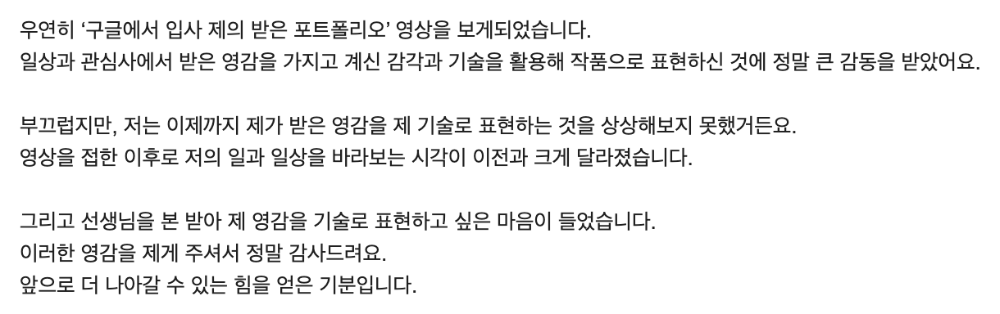
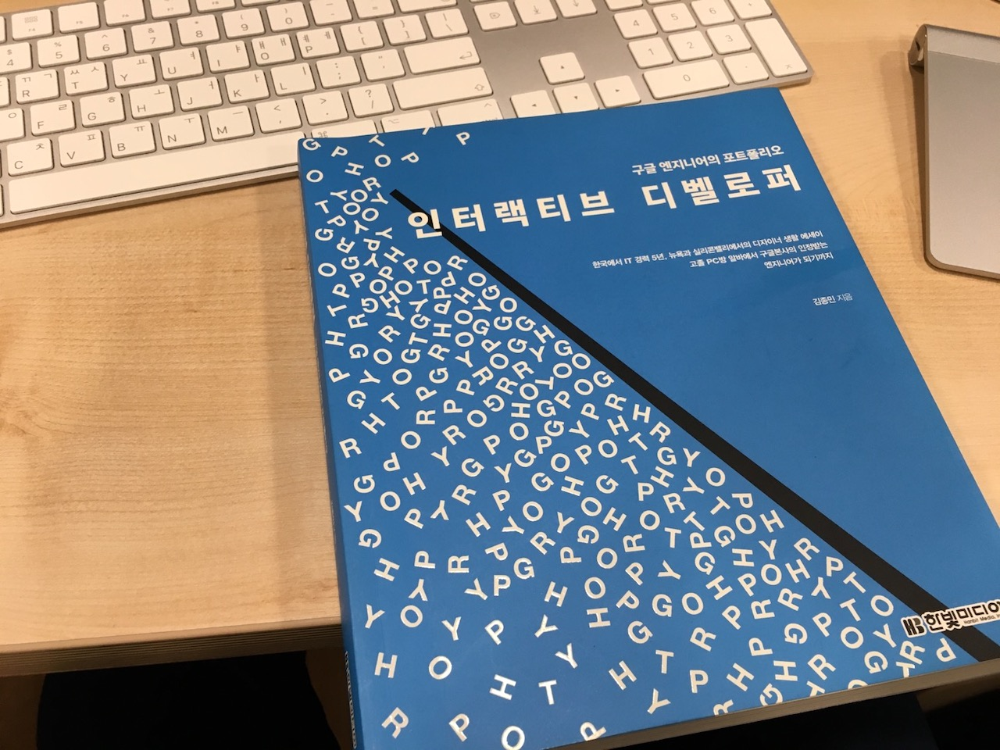
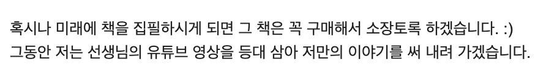
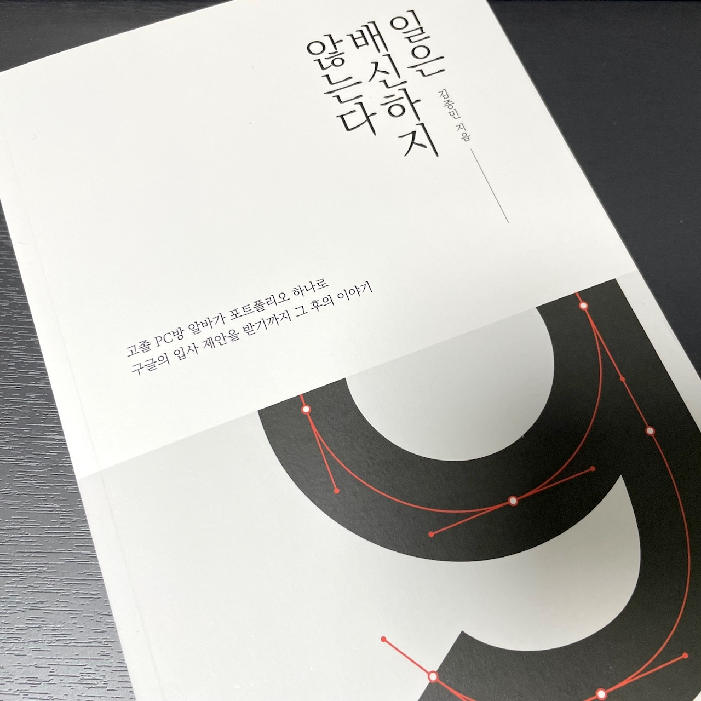

나의 개발자로서의 삶에 영향을 주신 분 중 김종민 선생님이 계시다. 그분 덕분에 내 기술로 많은 사람들에게 영감을 줄 수 있다는 것을 깨닫게 되었다. 또한 일과 성장, 그리고 삶에 대한 가치관 정립에 큰 도움을 받았다.

2020년 어느 날, 우연히 유튜브 영상을 통해 그분을 알게 되었다. 영상을 몇 편 보자마자 감동과 깨달음이 밀려와서 바로 메일을 보냈던 기억이 난다. 영감을 주신 것에 대해 감사함을 전하고 싶었다.

*감사함을 전했던 메일 중 일부*

당시 김종민 님이 집필한 '인터랙티브 디벨로퍼'라는 책을 읽고 싶었지만, 절판된 상태였다. 그러던 중 회사의 디자이너분과 이야기를 나누다가 그분이 책을 소장하고 계시다는 사실을 알게 되었고, 흔쾌히 빌려주셔서 다행히 읽을 수 있었다. 빌린 기간 동안 정말 본받고 싶어 열심히 2회독을 했다.

*동료 디자이너분이 빌려주셔서 읽을 수 있었던 '인터랙티브 디벨로퍼'*

최근 그분의 새로운 책 '일은 배신하지 않는다'가 2021년에 출간되었다는 소식을 늦게나마 듣고, 바로 구매했다. 2020년 메일에서 미래에 책을 집필하시게 되면 그 책은 꼭 구매해 소장하겠다고 약속 아닌 약속을 했었기 때문이다. 2020년 그때의 설레고 벅찬 마음을 떠올리며 읽기 시작한다.

*미래에 집필하실 책은 꼭 구매해 소장하겠다는 메일 내용*

*'일은 배신하지 않는다'를 읽기 전에*
