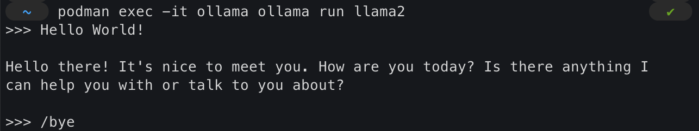
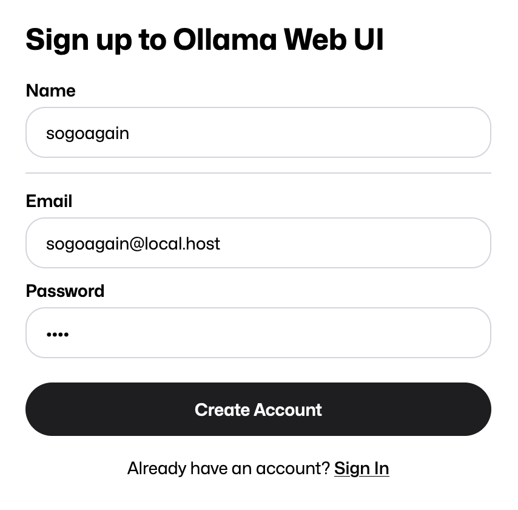
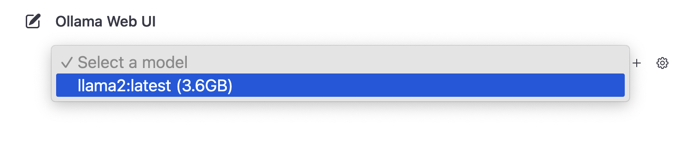
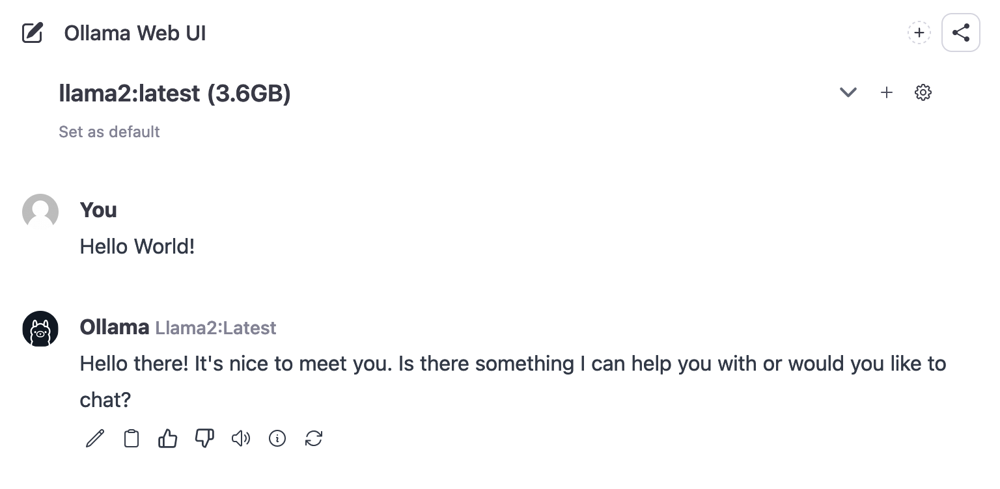

# 배경

`ChatGPT`와 같은 상용 대규모 언어 모델(이하 LLM) 서비스는 개인의 일상과 업무의 효율성을 높여주지만, 데이터가 외부로 전송되기에 개인 혹은 회사의 민감한 데이터를 활용하기에는 제약이 많다. 만일, 개인 컴퓨터(로컬)에서 직접 구동되는 LLM을 사용한다면 이러한 제약에서 자유로울 것이다. 따라서 이번 글에서는 다양한 LLM 들을 쉽게 구동시켜 주는 `Ollama` 라는 도구를 활용하여 로컬에서 LLM을 구동시키고 사용하는 방법에 대해 소개한다.

# 사용 도구

## [Ollama](https://ollama.ai/)

`Ollama`는 다양한 LLM을 로컬 환경에 설치하고 구동시켜 주는 도구다. 이를 이용하면 예를 들어 메타의 [`Llama 2`](https://ai.meta.com/llama/)나 [`CodeLlama`](https://github.com/facebookresearch/codellama)와 같은 모델을 쉽게 다운받고 구동시킬 수 있다.

## [Ollama Web UI](https://github.com/ollama-webui/ollama-webui)

`Ollama Web UI`는 `Ollama`를 이용해 로컬에서 구동한 모델을 `ChatGPT`와 유사한 인터페이스로 사용할 수 있게 도와주는 웹 서비스다. 로컬에서 손쉽게 구동할 수 있고 로그인, 대화 이력, 모델 파라미터 조정 등의 기능을 제공한다.

# 설치 및 실행

## 1. 사전 준비

쉬운 설치와 운영을 위해 컨테이너 환경을 사용할 것이므로 [`Podman`](https://podman.io/)이 설치되어 있어야 한다.

> `Docker`도 가능하지만, 이 글에서는 `Podman`을 기준으로 설명하므로 일부 실행 옵션이 다를 수 있다.

## 2. Ollama 설치 및 실행

### 컨테이너 실행

```sh
podman run -d \
  -v ollama:/root/.ollama \
  -p 11434:11434 \
  --name ollama \
  docker.io/ollama/ollama
```

### LLM 구동하기

아래 명령어를 통해 `Llama 2` 모델(약 3.5GB)을 로컬에서 구동하여 대화를 나눌 수 있다.

```sh
podman exec -it ollama ollama run llama2
```
대화를 종료하려면 `/bye` 명령어를 입력한다.



## 2. Ollama Web UI 설치 및 실행

### 컨테이너 실행

```sh
podman run -d \
  -p 3000:8080 \
  --network slirp4netns:allow_host_loopback=true \
  -v ollama-webui:/app/backend/data \
  --name ollama-webui \
  --restart always \
  ghcr.io/ollama-webui/ollama-webui:main
```

### 접속

웹 브라우저를 실행하여 http://localhost:3000 URL로 접속한다.

### 회원가입 (로컬)

초기 화면에서 회원가입을 해야 하는데 로컬에서 실행 중인 `Ollama Web UI` 서버에 저장되는 정보라 간단히 입력하여 회원가입한다.



### 대화하기

로그인하면 LLM 모델과 대화할 수 있는 페이지가 출력된다. 상단에 있는 모델 선택 메뉴에서 앞서 설치한 `Llama 2` 모델을 선택한 뒤 대화를 시작하면 된다.





# 마치며

`Ollama` 도구를 이용해 로컬에서 구동되는 나만의 인공지능 챗봇을 구축해 보았다. 로컬에서 실행되는 것이라 상용 LLM에 비해선 성능이 낮고 한국어를 잘하지 못한다는 단점이 있지만, 개인의 데이터를 보호하며 인공지능을 이용할 수 있게 되었다. 현재 로컬에서 인공지능 모델을 효과적으로 구동시키기 위한 다양한 연구들이 활발히 진행되고 있기에 앞으로의 발전이 무척이나 기대된다. 이러한 연구와 시도를 통해 머지않은 미래에 모두가 손안에 각자의 인공지능 비서를 두는 세상이 오지 않을까 생각해 본다.
