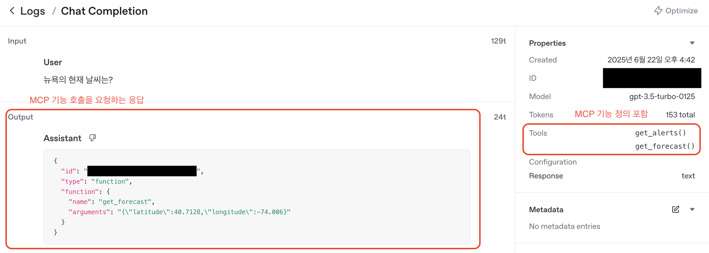

# MCP, 왜 필요할까?

## LLM의 한계

- LLM은 텍스트 생성만 할 수 있음
- 즉, LLM은 “행동”을 할 수 없음
    - 예를 들어, LLM은 스스로 인터넷 브라우징을 할 수 없음

### 기존의 해결책

- LLM에게 필요한 도구(행동)를 각각의 애플리케이션 개발자가 구현
    - 예를 들어, ChatGPT에서 GPT가 인터넷 브라우징을 할 수 있게 OpenAI 개발자가 웹 브라우징 기능을 개발하여 제공

### 기존 해결책의 문제점

- “행동”을 위한 기능이 애플리케이션에 종속됨
- 즉, 확장성과 이식성에 문제
    - ChatGPT의 인터넷 브라우징 기능을 다른 LLM 애플리케이션에서는 사용하지 못함

### 프로토콜을 통한 해결

- LLM의 “행동”을 위한 기능의 제공과 사용을 프로토콜로 정의
- 확장성과 이식성 문제 해결

# MCP 아키텍처 및 구성 요소


## MCP Host

- LLM을 사용하는 애플리케이션 (Claude, IDE 등)

## MCP Client

- LLM이 요청한 도구를 사용하기 위해 MCP Server와 통신

## MCP Server

- LLM이 사용할 수 있는 도구들을 제공

# MCP가 제공할 수 있는 것들

## Tools

- 데이터 조회, 연산 수행 등 LLM 에게 손과 발이 되어주는 기능들
- 수행 전 사용자의 승인이 필요

## Resources

- PDF 문서, 이미지 등의 파일과 같은 정적 자원을 제공

## Prompts

- 특수한 목적을 위해 미리 작성된 프롬프트를 제공
    - 예를 들어, 코드리뷰를 위한 MCP 서버라면 프로그래밍 언어, 프레임워크 등의 정보를 전달받아 그에 알맞은 프롬프트를 제공

# 데이터 전송 방법

## 1. 표준입출력 (STDIO)

- 로컬에서 작동시키는 MCP Server에서 사용

## 2. SSE

- 원격에서 작동시키는 MCP Server에서 사용
- HTTP GET/POST 요청

## MCP Client와 MCP Server는 1:1 연결


# MCP를 지원하는 LLM 애플리케이션의 작동 흐름

## 시퀀스 다이어그램


## 간단한 LLM 에이전트

- 시퀀스 다이어그램의 각 단계를 확인할 수 있는 `LangGraph`로 개발한 간단한 에이전트
- MCP Client로서 MCP Server를 활용해 사용자 질의에 답변 생성

### 코드

```python
async def main():
    async with stdio_client(stdio_server_params) as (read, write):
        async with ClientSession(read_stream=read, write_stream=write) as session:
            # 1. 연결 초기화
            await session.initialize()
            # 2. 제공 가능한 Tool 조회
            tools = await load_mcp_tools(session)
            agent = create_react_agent(llm, tools)
            # 3. 질의
            result = await agent.ainvoke({"messages": [HumanMessage(content="뉴욕의 현재 날씨는?")]})
            # 10. 응답
            print(result["messages"][-1].content)
```

### LangGraph 실행 트레이스


### GPT 문장 생성 API 호출 로그

- MCP 기능 호출 응답 로그 (시퀀스 다이어그램 4~6 단계)



- 최종 응답 텍스트 생성 로그 (시퀀스 다이어그램 9~11 단계)


### 실행 결과


